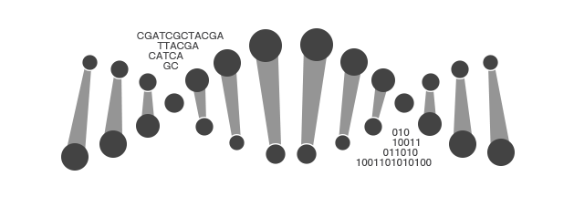

# Bioinformatics Tutorial - Basic

## Teaching Philosophy


[**🎦**](https://www.bilibili.com/video/av67132141?pop_share=1) **Study and Practice \| 格物致知 知行合一**

We teach professional skills in bioinformatics. These skills are not just running software. They will give you freedom of exploring various real data.


## **Aim**


**写在前面的话**

相对于过去，突然地，我们发现数据不是太少而是太多，信息不是匮乏而是繁杂，新一代人的重要能力是“鉴别”和“挖掘”。

对生物信息学的工作而言，最重要的、最有用的基本工具和技能过去一直是，我相信很长一段时间也会始终是：

1. google
2. wikipedia
3. 知乎


**We aim to teach basic data skills that give you freedom.**

> * Running bioinformatics software isn’t all that difficult, doesn’t take much skill, and it doesn’t embody any of the significant challenges of bioinformatics.…**These data skills give you freedom**…
> * I believe these two qualities — **reproducibility** and **robustness.**
> * So what is a reproducible bioinformatics project? At the very least, it’s **sharing your project’s code and data**.  
> * In wet lab biology, when experiments fail, it can be very apparent, but this is not always true in computing. Electrophoresis gels that look like Rorschach blots rather than tidy bands clearly indicate something went wrong. Unfortunately, **without prior expectations**, it can be quite difficult to distinguish good results from bad results.
> * The easy way to ensure everything is working properly is to **adopt a cautious attitude** , and **check everything between computational steps**.
> * You will **almost certainly have to rerun an analysis more than once**.
> * **Write Code for Humans, Write Data for Computers**
> * **Use Existing Libraries Whenever Possible**
> * **Treat Data as Read-Only**
> * **Document Everything** \(-- Too geeky?\) Just as a well-organized laboratory makes a scientist’s life easier, a well-organized and well-documented project makes a bioinformatician’s life easier.
>
> -- &lt;&lt;Bioinformatics Data Skills&gt;&gt;

## Major Authors

Yumin Zhu, Gang Xu, Zhuoer Dong, Yinghui Chen, Meifeng Zhou, Xupeng Chen, Xiaocheng Xi, Xi Hu, Jingyi Cao, Xiaofan Liu, Weihao Zhao, Siqi Wang and Zhi J. Lu

| Section | Major Authors |
| :--- | :--- |
| **Part I. Basic Skills** |  |
| 1.Setup | Zhi John Lu |
| 1.1 Docker | Gang Xu |
| 1.2 Cluster | Gang Xu |
| 2.Linux | Zhi John Lu |
| 2.1 Basic Command | Zhuoer Dong/Xi Hu |
| 2.2 Practice Guide | Zhuoer Dong/Xi Hu |
| 2.3 Linux Bash | Gang Xu |
| 3.R |  |
| 3.1 R Basics | Zhuoer Dong |
| 3.2 Plot with R | Zhuoer Dong/Xiaochen Xi |
| 4.Python |  |
|  |  |
| **PART II. BASIC ANALYSES** |  |
| 1.Blast | Gang Xu |
| 2.Conservation Analysis | Xi Hu |
| 3.Function Analysis |  |
| 3.1 GO | Gang Xu |
| 3.2 KEGG | Gang Xu |
| 3.3 GSEA | Zhuoer Dong |
|  |  |
| **Part III. NGS DATA ANALYSES** |  |
| 1.Mapping | Meifeng Zhou/Yumin Zhu |
| 2.RNA-seq |  |
| 2.1 Differential Expression | Meifeng Zhou |
| 2.2 Alternative Splicing | Zhuoer Dong |
| 3.ChIP-seq | Jingyi Cao |
| 4.Network |  |
| 4.1.Co-expression Network | Xiaochen Xi |
| 4.2.miRNA Targets | Yumin Zhu |
| 4.3.RBP-RNA Interactions | Yumin Zhu |
| 5.Motif |  |
| 5.1.Sequence Motif | Yumin Zhu |
| 5.2.Structure Motif | Yumin Zhu |
| 6.RNA Regulation Analyses |  |
| 6.1.RNA Editing | Yumin Zhu |
| 6.2.APA \(Alternative Polyadenylation\) | Yumin Zhu |
| 6.3.Ribo-seq | Yumin Zhu |
| 6.4.Structure-seq | Yumin Zhu |
| 6.5.Chimeric RNA | Yinghui Chen |
| 6.6.SNV Calling | Yinghui Chen |
| 7.Clinical Analyses |  |
| 7.1.ROC Curve | Weihao Zhao/Yumin Zhu |
| 7.2.PCA/tSNE | Xupeng Chen/Xiaofan Liu |
| 7.3.Survival Analysis | Xiaochen Xi/Yumin Zhu |
|  |  |
| **Part IV. MACHINE LEARNING** |  |
| 1.Machine Learning Basics | Xupeng Chen/Zhi John Lu |
| 2. Machine Learning with R | Xupeng Chen/Xiaofan Liu |
| 3. Machine Learning with Python | Xupeng Chen/Xiaofan Liu |
|  |  |
| **Appendix** |  |
| Appendix I. Keep Learning | Zhi John Lu |
| Appendix II. Databases & Servers | Yumin Zhu |
| Appendix III. How to Backup | Gang Xu/Zhi John Lu |
| Appendix IV. Teaching Materials | Gang Xu/Zhi John Lu |

## Contact Us

* Lu Lab 鲁 志 实验室
* School of Life Sciences, Tsinghua University, Beijing, China
* e-mai: lulab1 AT tsinghua.edu.cn
* Hompage: [http://lulab.life.tsinghua.edu.cn](http://lulab.life.tsinghua.edu.cn) \| [https://www.ncrnalab.org](https://www.ncrnalab.org)
* GitHub: [https://lulab.github.io](https://lulab.github.io)
* Docs/Books: [https://lulab.gitbook.io](https://lulab.gitbook.io)
* Software: [https://software.ncrnalab.org](https://software.ncrnalab.org)

## Copyright

Copyright © 2019 Lu Lab

[https://www.apache.org/licenses/LICENSE-2.0](https://www.apache.org/licenses/LICENSE-2.0)

> 2019年9月于清华园
>
> 本书在清华大学《生物信息学导论》课和《生物信息学实践》课上机指南的基础上编写。

