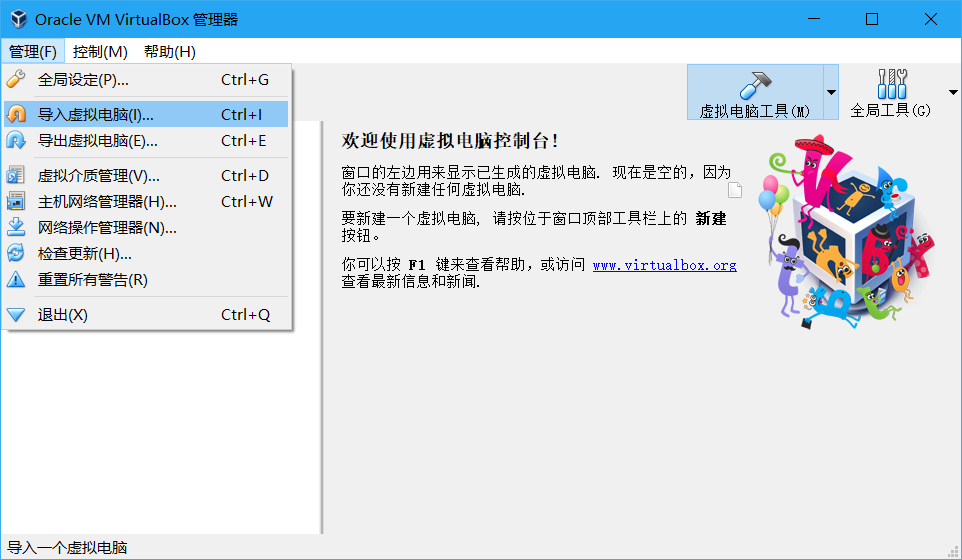

## 2\) windows 10 非 pro 用户使用 Docker 指南——通过Virtual Box 运行docker 

此部分教程将介绍如何在windows 10 非pro机器上使用virtual box，安装并配置好virtual box后即可在其内部运行docker, 请使用我们提供的虚拟机镜像：[bioinfo_tsinghua.virtualbox.ova](https://cloud.tsinghua.edu.cn/d/caa53a001d7647cbb06c/) （用户名和密码均为 `test`）。

### 2a\) 安装 Virtual Box

至 [官网](https://www.virtualbox.org/wiki/Downloads) 下载安装程序，运行，按照提示完成安装。

### 2b\) 下载虚拟机镜像

下载我们提供的 Ubuntu 虚拟机镜像 （用户名和密码均为 `test`）。

### 2c\) 导入虚拟机

`管理` -&gt; `导入虚拟电脑`

选中上一步下载完成的 `bioinfo_tsinghua.virtualbox.ova`

> **注意：** 路径名不能有空格、中文等，可以直接放在某一磁盘下，比如这里我们放在了 D 盘。

导入时一般使用默认选项即可。如果 C 盘空间不足，可以修改以下最后一个选项——`虚拟硬盘`，需要手动输入路径，与上文一样，不能有空格、中文等。

### 2d\) 启动虚拟机

导入完成后，启动 `bioinfo_tinghua`, 等待2至5分钟，虚拟机即可使用。

### 2e\) 打开 Terminal

### 2f\) 运行

顺利完成以上步骤后，请到 *Setup（Docker）* 章节中的 *1a\) 载入镜像* 开始进行操作。 完成后续操作。
