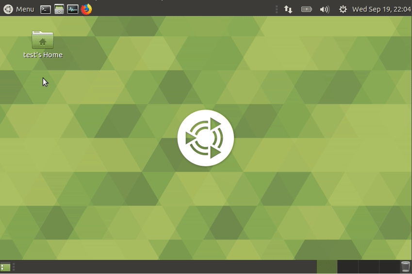

# 1.1 Docker

## 0\) Docker下载

Docker 因为其灵活性和资源占用少等优势开始取代过去传统的虚拟机（如VMWARE, Virtual Box等）。Docker在容器的基础上，进行了进一步的封装，从文件系统、网络互联到进程隔离等等，极大的简化了容器的创建和维护。使得 Docker技术比传统虚拟机技术更为轻便、快捷（[为什么使用Docker](https://yeasy.gitbooks.io/docker_practice/introduction/why.html)）。

> 如果遇到使用问题，还可以参考官网的 [这篇文章](https://docs.docker.com/docker-for-mac/)。

### 0a\) Docker程序\(software）下载和安装

读者可以去 [官方下载页面](https://www.docker.com/get-docker) 获取对应不同操作系统的docker软件的安装程序。（需要注册账号）

> **系统要求**：
>
> * Mac: 2010 or newer model
> * Linux: kernel 3.10 or higher
> * Windows: 10 pro及以上 \(64位\)
>
> windows 10 非pro版本的读者请注意：只有pro版本才能安装docker程序，所以如果不是pro版本，大家可以下载并安装虚拟机 [VirtualBox](https://www.virtualbox.org/wiki/Downloads) ，我们也提供了一个虚拟机镜像，但不再维护。

### 0b\) Docker镜像\(image）下载

我们为读者提供了我们为本课程制作的用于Docker的一个**image（镜像）**，如下表所示:

安装Docker程序并下载image文件到桌面（`~/Desktop`）

**各操作系统下的安装docker程序和加载docker镜像指南:**


## 1\) MAC 用户使用 Docker 指南

> 观看视频教程：如何使用docker（基于Mac）
>
> 可以选择观看视频教程，也可以跳过视频按照文字教程安装和配置docker。
>
> [youtube](https://youtu.be/c1ldhV7dAhg)
>
> [bilibili](https://www.bilibili.com/video/av30426956/)

### 1a\) 载入镜像 <a id="load-image"></a>

```bash
docker load -i ~/Desktop/bioinfo_PartI-PartII-PartIII1-3.tar.gz # only if Mac or Windows 10 Pro

docker load -i ~/Desktop/bioinfo_PartI-PartII-PartIII1-3.tar.gz # Otherwise
```

### 1b\) 创建并运行容器 <a id="create-container"></a>

```bash
mkdir ~/Desktop/bioinfo_tsinghua_share

docker run --name=bioinfo_tsinghua -dt --restart unless-stopped -v ~/Desktop/bioinfo_tsinghua_share:/home/test/share bioinfo_tsinghua
```

这里我们新建了一个名为 `bioinfo_tsinghua` 的容器（除非有特殊说明，接下来的章节中所有操作均在该容器中进行）。

> 参数说明：
>
> * 设置该容器能一直在后台保持运行状态（`-dt --restart unless-stopped`）
> * 主机\(HOST, 例如Mac或者Windows）和docker容器（例如Linux）设置了一个文件夹同步，可以互传文件：
>   * HOST: `~/Desktop/bioinfo_tsinghua_share` == LINUX: `/home/test/share`

### 1c\) 退出容器

用以下命令退出容器：

```bash
exit
```

### 1d\) 重复使用容器 <a id="use-container"></a>

到此为止，我们已经成功地安装了Docker，成功地载入一个镜像并且创建了容器（container）。以后我们再使用Docker并进入该容器练习，只需要反复执行3个步骤:

#### 1d.1\) 双击运行docker程序

#### 1d.2\) 运行该教程创建的容器（container）

在终端/Powershell中输入以下命令，即可进入容器：

```bash
docker exec -it bioinfo_tsinghua bash
```

正确输入该命令后会进入容器内部，可以看到我们准备的本教程相关的文件和软件。如下图所示


#### 1d.3\) 在容器进行Linux操作

#### 1d.4\) 退出容器

用以下命令退出容器：

```bash
exit
```

## 2\) windows 10 非 pro 用户使用 Docker 指南——通过Virtual Box 运行docker <a id="win-vb-use-docker"></a>

此部分教程将介绍如何在windows 10 非pro机器上使用virtual box，安装并配置好virtual box后即可在其内部运行docker, 请使用我们提供的虚拟机: [bioinfo\_tsinghua.virtualbox.ova](https://cloud.tsinghua.edu.cn/f/9939462501ca47b09a9b/) （用户名和密码均为 `test`）。

### 2a\) 安装 Virtual Box

至 [官网](https://www.virtualbox.org/wiki/Downloads) 下载安装程序，运行，按照提示完成安装。

### 2b\) 下载虚拟机

下载我们提供的 Ubuntu 虚拟机：[bioinfo\_tsinghua.virtualbox.ova](https://cloud.tsinghua.edu.cn/f/c91ec26fc5774303a5df/) （用户名和密码均为 `test`）。

### 2c\) 导入虚拟机

`管理` -&gt; `导入虚拟电脑`


选中上一步下载完成的 `bioinfo_tsinghua.virtualbox.ova`


> **注意：** 路径名不能有空格、中文等，可以直接放在某一磁盘下，比如这里我们放在了 D 盘。


导入时一般使用默认选项即可。如果 C 盘空间不足，可以修改以下最后一个选项——`虚拟硬盘`，需要手动输入路径，与上文一样，不能有空格、中文等。


### 2d\) 启动虚拟机

导入完成后，启动 `bioinfo_tinghua`, 等待2至5分钟，虚拟机即可使用。


### 2e\) 打开 Terminal



### 2f\) 运行

顺利完成以上步骤后，请到本章的 [1a\) 载入镜像](1.1.docker.md#load-image) 开始进行操作。 完成后续操作。

## 3\) windows 10 pro 64 使用 Docker 指南 <a id="win-pro-use-docker"></a>

### 3a\) 安装 Docker

从 [官网](https://store.docker.com/editions/community/docker-ce-desktop-windows) 下载 Docker，并进行安装。

### 3b\) 启用Hyper-V

安装完成后，选择`Enable & Restart`以启用Hyper-V


### 3c\) 启动 Power shell

在开始菜单搜索 PowerShall, 并启动。


### 3d\) 检查安装

输入以下命令，检查 Docker 是否成功安装。


### 3e\) 导入 Docker 镜像

将 Docker image: [bioinfo\_PartI-PartII-PartIII1-3.tar.gz](https://cloud.tsinghua.edu.cn/f/a74250736c6748a0867b/)下载到桌面，并且通过在 Power shell 中输入以下命令导入将镜像导入到 Docker 中。

```bash
docker load -i Desktop\bioinfo_PartI-PartII-PartIII1-3.tar.gz
```


### 3f\) 首次创建容器

首先，在桌面新建 `bioinfo_tsinghua_share` 文件夹用于共享文件

```bash
mkdir ~/Desktop/bioinfo_tsinghua_share
```

然后，新建一个名为 `bioinfo_tsinghua` 的容器（除非有特殊说明，接下来的章节中所有操作均在该容器中进行）。

```bash
docker run --name=bioinfo_tsinghua -dt --restart unless-stopped -v ~/Desktop/bioinfo_tsinghua_share:/home/test/share bioinfo_tsinghua
```

> 参数说明：
>
> * 设置该容器能一直在后台保持运行状态（`-dt --restart unless-stopped`）
> * 主机 \(Windows）和docker容器（例如Linux）设置了一个文件夹同步，可以互传文件：
>   * Windows: `~/Desktop/bioinfo_tsinghua_share` == LINUX: `/home/test/share`

在 Windows 10 Pro 上，我们在 Docker 中创建的 `/home/test/share` 归 root 所有，所以要将其改为归 test 用户所有。

```bash
docker exec -u root bioinfo_tsinghua chown test:test /home/test/share
```

执行这一步时，系统会弹出以下提示，我们选择 `Share it`


### 3g\)使用容器

如果容器创建成功，之后每次只需要启动Docker程序，然后在 Power shell 中输入以下命令即可进入容器：

```bash
docker exec -it bioinfo_tsinghua bash
```

之后即可运行本教程中提供的 Linux 命令来执行任务，比如 1.Linux 这一章的 `ls`

任务完成后，输入 `exit` 即可回到 Power shell。


## 4\) docker 常用命令

### **4a\) 检查Docker是否安装成功**

> 以上三种用户安装完成后，均可打开 Terminal \(Windows 下使用 PowerShell\), &gt; 运行以下命令，检查 Docker 是否正常安装：
>
> ```text
> docker info
> ```

### 4b\) 查看容器运行状态

```bash
docker ps #查看当前正在运行的容器
docker ps -a #查看所有容器
docker images #查看所有镜像
```

### 4c\) 彻底删除容器 <a id="recover-container"></a>

如果你不小心执行了错误操作，以至于无法正常执行本教程中的某一章节，可以删除该容器，然后新建一个干净的容器。

首先，

```bash
docker rm -f bioinfo_tsinghua
```

> **Tips**：之前提到过 `bioinfo_tsinghua` 一直保持运行状态，所以我们这里用 `-f` 来强制（force）删除。

然后，重复创建容器命令。

### 4d\) 清理环境

可以使用如下命令清理不再需要的文件：

```bash
rm ~/Desktop/bioinfo_tsinghua.docker.tar.gz # 删除下载的文件
```

如果需要删除镜像，可以使用以下命令，请**慎重**使用该命令。

```text
docker rmi bioinfo_tsinghua # 删除镜像
```

## 5\) 参考阅读

> 这里推荐阅读两篇Docker安装教程，分别是[《macOS 安装 Docker》](https://yeasy.gitbooks.io/docker_practice/install/mac.html)和[《Windows 10 PC 安装 Docker CE》](https://yeasy.gitbooks.io/docker_practice/install/windows.html)，来自于[《Docker——从入门到实践》](https://legacy.gitbook.com/book/yeasy/docker_practice/details)书，这本书对Docker进行了深入浅出的讲解，对于初学者理解和学习docker技术有所帮助。另外，网上也有很多docker教程，有深入学习兴趣的同学可以自行检索学习。

