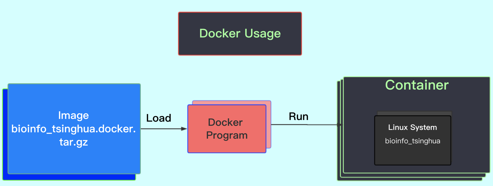
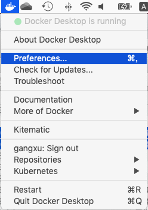
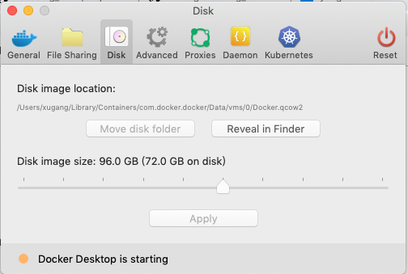

# 1.1 Docker

## 0\) Docker下载

Docker 因为其灵活性和资源占用少等优势开始取代过去传统的虚拟机（如VMWARE, Virtual Box等）。Docker在容器的基础上，进行了进一步的封装，从文件系统、网络互联到进程隔离等等，极大的简化了容器的创建和维护。使得 Docker技术比传统虚拟机技术更为轻便、快捷（[为什么使用Docker](https://yeasy.gitbooks.io/docker_practice/introduction/why.html)）。

> 如果遇到使用问题，还可以参考官网的 [这篇文章](https://docs.docker.com/docker-for-mac/)。

### 0a\) Docker程序\(software）下载和安装

读者可以去 [官方下载页面](https://docs.docker.com/docker-for-windows/install/) 获取对应不同操作系统的docker软件的安装程序。（需要注册账号）

> **系统要求**：
>
> * Mac: 2010 or newer model
> * Linux: kernel 3.10 or higher
> * Windows: 10 pro及以上 \(64位\)
>
> Windows 10 非pro版本的读者请注意：因为只有pro版本才能安装docker程序，所以我们强烈建议您升级pro版本，清华官方有免费的校园正版下载。或者在自己的电脑上安装Linux双系统。如果实在没法升级和安装双系统，可以尝试在低级Windows中安装虚拟机Virtual Box, 我们也提供了一个[Virtual Box虚拟机镜像](https://github.com/lulab/teaching_book/blob/master/appendix/Deprecated1.virtual-box.md)，但不再维护。

### 0b\) Docker镜像\(image）下载

我们为读者提供了我们为本课程制作的用于Docker的**image（镜像）**，下载链接如[附表](../../appendix/appendix-iv.-teaching.md#teaching-docker)所示.

**首先，请大家安装Docker程序并下载image文件到桌面，桌面的默认路是：** `~/Desktop`

> 安装和加载图示: 

## 1\) MAC 用户使用 Docker 指南

### 1a\) 载入镜像 <a id="load-image"></a>

请先双击运行docker程序，然后打开"终端"\(Teriminal\)程序开始"载入镜像"以及后面的操作；

**以下命令默认都是在“Terminal”中运行。**

```bash
docker load -i ~/Desktop/bioinfo_PartI-PartII-PartIII1-3.tar.gz  #load the image
```

> 注： “\#”以及"\#"之后的内容是注释语句，实际操作中不用输入。

### 1b\) 创建并运行容器 <a id="create-container"></a>

```bash
mkdir ~/Desktop/bioinfo_tsinghua_share

docker run --name=bioinfo_tsinghua -dt  -h bioinfo_docker --restart unless-stopped -v ~/Desktop/bioinfo_tsinghua_share:/home/test/share bioinfo_tsinghua
```

这里我们新建了一个名为 `bioinfo_tsinghua` 的容器（除非有特殊说明，接下来的章节中所有操作均在该容器中进行）。

> 参数说明：
>
> * 设置该容器能一直在后台保持运行状态（`-dt --restart unless-stopped`）
> * 主机\(HOST, 例如Mac或者Windows）和docker容器（例如Linux）设置了一个文件夹同步，可以互传文件：
>   * HOST: `~/Desktop/bioinfo_tsinghua_share` == LINUX: `/home/test/share`

**到此为止，我们已经成功地安装了Docker程序，成功地载入一个镜像 \(image\) 并且创建了容器（container）。**

### 1c\) 使用和退出容器 <a id="use-container"></a>

使用一个容器（例如上节中开启的容器："bioinfo\_tsinghua"\) 进行练习，只需要反复执行如下3个步骤:

> 注：每次使用容器时要检查docker程序是否运行了，否则请双击docker程序图标运行docker程序

* 1c.1\) 运行容器:  在Terminal/Power shell中输入 `docker exec -it bioinfo_tsinghua bash` 
* 1c.2\) 进行Linux系统的相关操作，如下图
* 1c.3\) 退出容器：`exit` 


## 2\) windows 10 pro 64 使用 Docker 指南 <a id="win-pro-use-docker"></a>

### 2a\) 安装 Docker

从 [官网](https://store.docker.com/editions/community/docker-ce-desktop-windows) 下载 Docker，并进行安装。

### 2b\) 启用Hyper-V

安装完成后，选择`Enable & Restart`以启用Hyper-V


### 2c\) 启动 Power shell

在开始菜单搜索 PowerShall, 并启动。


### 2d\) 检查安装

输入以下命令，检查 Docker 是否成功安装。


### 2e\) 导入 Docker 镜像

将 Docker image下载到桌面，并且通过在 Power shell 中输入以下命令导入将镜像导入到 Docker 中。

```bash
docker load -i Desktop\bioinfo_PartI-PartII-PartIII1-3.tar.gz
```


### 2f\) 首次创建容器

首先，在桌面新建 `bioinfo_tsinghua_share` 文件夹用于共享文件

```bash
mkdir ~/Desktop/bioinfo_tsinghua_share
```

然后，新建一个名为 `bioinfo_tsinghua` 的容器（除非有特殊说明，接下来的章节中所有操作均在该容器中进行）。

```bash
docker run --name=bioinfo_tsinghua -dt -h bioinfo_docker --restart unless-stopped -v ~/Desktop/bioinfo_tsinghua_share:/home/test/share bioinfo_tsinghua
```

> 参数说明：
>
> * 设置该容器能一直在后台保持运行状态（`-dt --restart unless-stopped`）
> * 主机 \(Windows）和docker容器（例如Linux）设置了一个文件夹同步，可以互传文件：
>   * Windows: `~/Desktop/bioinfo_tsinghua_share` == LINUX: `/home/test/share`

在 Windows 10 Pro 上，我们在 Docker 中创建的 `/home/test/share` 归 root 所有，所以要将其改为归 test 用户所有。

```bash
docker exec -u root bioinfo_tsinghua chown test:test /home/test/share
```

执行这一步时，系统会弹出以下提示，我们选择 `Share it`


### 2g\) 使用和退出容器

如果容器创建成功，之后每次只需要启动Docker程序，然后在 Power shell 中输入以下命令即可进入容器：

```bash
docker exec -it bioinfo_tsinghua bash
```

之后即可运行本教程中提供的 Linux 命令来执行任务；

任务完成后，输入 `exit` 即可回到 Power shell。


## 3\) docker 常用命令

### 3a\) 检查Docker是否安装成功

> 以上三种用户安装完成后，均可打开 Terminal \(Windows 下使用 PowerShell\), &gt; 运行以下命令，检查 Docker 是否正常安装：
>
> ```text
> docker info
> ```

### 3b\) 查看容器运行状态

```bash
docker ps #查看当前正在运行的容器
docker ps -a #查看所有容器
docker images #查看所有镜像
```

### 3c\) 彻底删除容器 <a id="recover-container"></a>

如果你不小心执行了错误操作，以至于无法正常执行本教程中的某一章节，可以删除该容器，然后新建一个干净的容器。

首先，

```bash
docker rm -f bioinfo_tsinghua
```

> **Tips**：之前提到过 `bioinfo_tsinghua` 一直保持运行状态，所以我们这里用 `-f` 来强制（force）删除。

然后，重复创建容器命令。

### 3d\) 清理环境

可以使用如下命令清理不再需要的文件：

```bash
rm ~/Desktop/bioinfo_tsinghua.docker.tar.gz # 删除下载的文件
```

如果需要删除镜像，可以使用以下命令，请**慎重**使用该命令。

```text
docker rmi bioinfo_tsinghua # 删除镜像
```

## 4\) 设置CPU，内存，存储空间

打开docker的控制菜单，通过 Preferences 选择卡来进行参数修改。



建议 CPUs 设置为4， 内存为7G， Swap为2G。


存储空间为90G。




## 5\) 视频教程

* Docker使用视频教程 [@Youtube](https://youtu.be/vp0t2T1KFG4) [@Bilibili](https://www.bilibili.com/video/av66604789?pop_share=1)

> **本章参考文献:**
>
> 这里推荐阅读两篇Docker安装教程，分别是[《macOS 安装 Docker》](https://yeasy.gitbooks.io/docker_practice/install/mac.html)和[《Windows 10 PC 安装 Docker CE》](https://yeasy.gitbooks.io/docker_practice/install/windows.html)，来自于[《Docker——从入门到实践》](https://legacy.gitbook.com/book/yeasy/docker_practice/details)书，这本书对Docker进行了深入浅出的讲解，对于初学者理解和学习docker技术有所帮助。另外，网上也有很多docker教程，有深入学习兴趣的同学可以自行检索学习。

