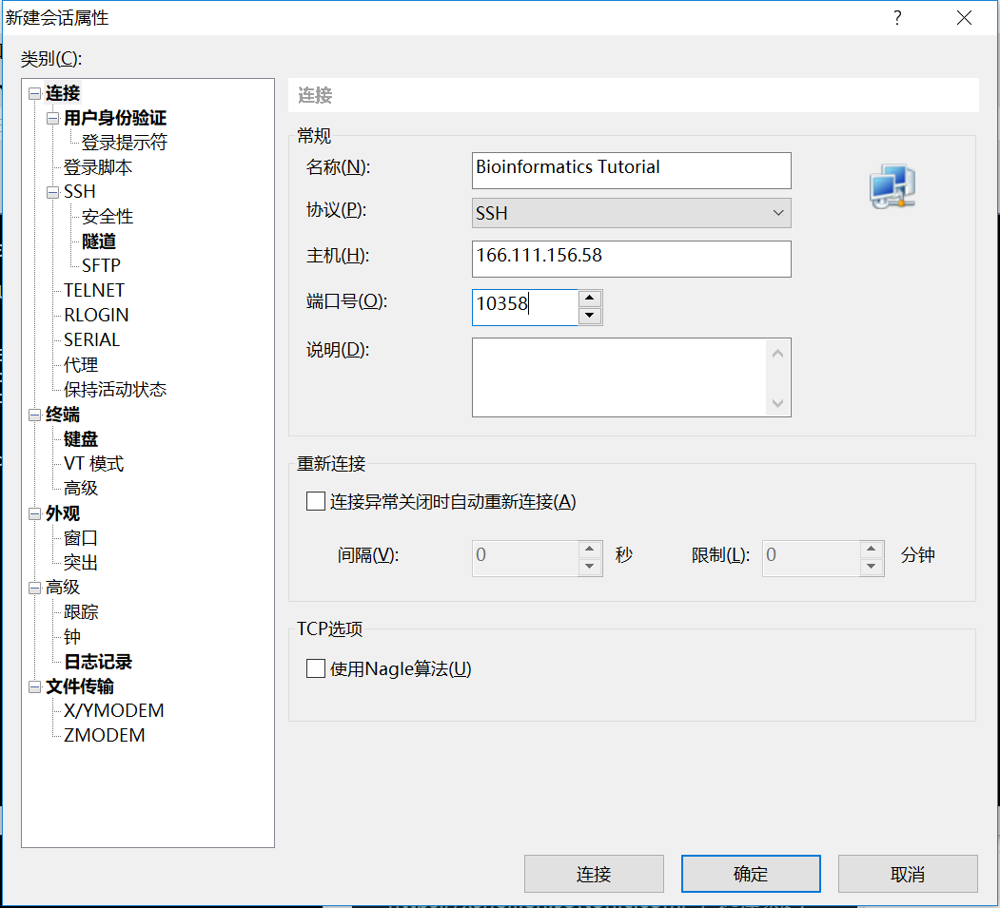
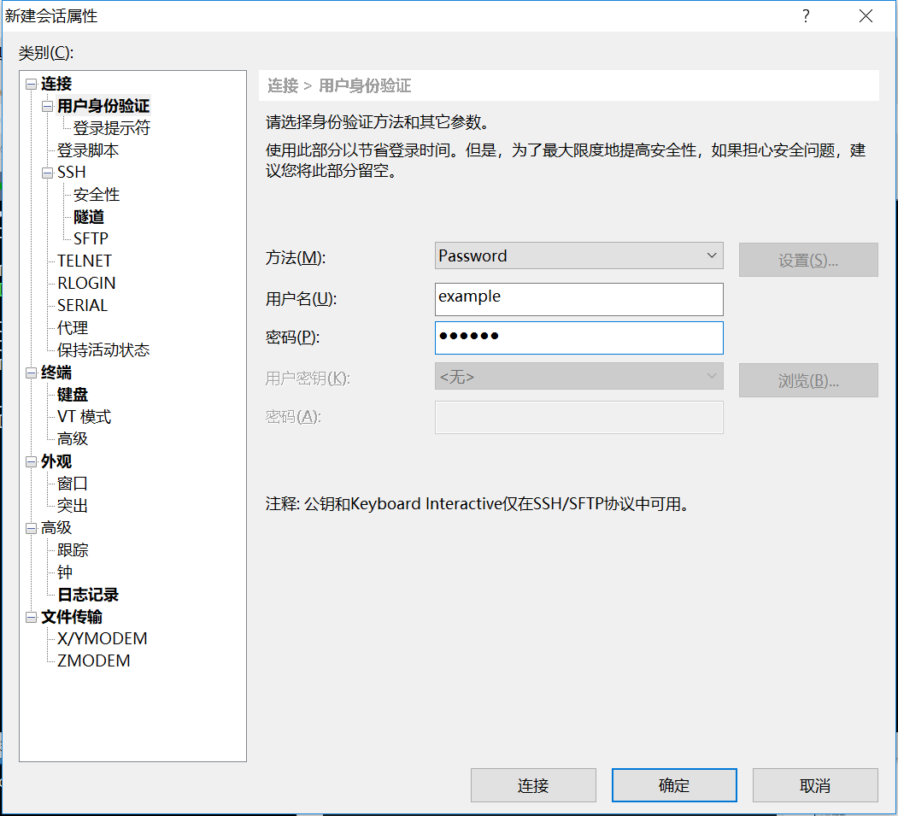
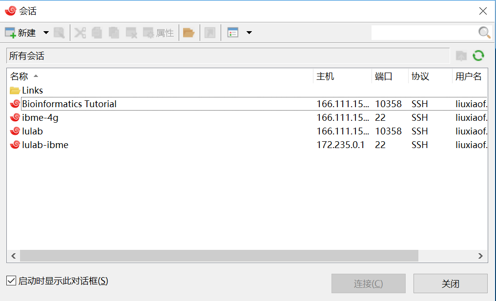

# 1.2 Cluster
## 0）cluster简介
生物信息学中的大多数数据处理任务比日常工作中需要更多的计算能力，这意味着我们必须使用大型服务器或计算集群。集群(cluster)就是一组相互独立的计算机，通过高速的网络组成一个计算机系统。对外表现为单一的系统，协同起来向用户提供系统资源，系统服务。
集群主要有以下3种：
1）负载均衡集群（Load balancing clusters）简称LBC。负载均衡集群把很多客户集中访问的请求负载压力可能尽可能平均的分摊到计算机集群中处理。客户请求负载通常包括应用程度处理负载和网络流量负载。这样的系统非常适合向使用同一组应用程序为大量用户提供服务。每个节点都可以承担一定的访问请求负载压力，并且可以实现访问请求在各节点之间动态分配，以实现负载均衡。负载均衡运行时，一般通过一个或多个前端负载均衡器将客户访问请求分发到后端一组服务器上，从而达到整个系统的高性能和高可用性。
2）高可用性集群（High-availability clusters）简称HAC。 一般是指当集群中的任意一个节点失效的情况下，节点上的所有任务自动转移到其他正常的节点上，并且此过程不影响整个集群的运行，不影响业务的提供。
3）高性能计算集群（High-perfomance clusters）简称HPC。高性能计算集群采用将计算任务分配到集群的不同计算节点儿提高计算能力，因而主要应用在科学计算领域。
下面以lulab实验室计算集群cnode为例，介绍集群的具体使用。
## 1）windows用户登陆cluster
此教程介绍，windows用户如何登陆集群，并进行文件传输。
### 1a)Xshell安装
XShell是一个强大的安全终端模拟软件，它支持SSH1,SSH2，以及Microsoft Windows平台的TELNET协议。XShell可以在Windows界面下用来访问远端不同系统下的服务器，从而比较好的达到远程控制终端的目的。下载地址：https://xshell.en.softonic.com/ ，选择家庭/学校免费版下载。
### 1b)Xshell远程连接
选择导航菜单的文件 --> 新建，输入名称和主机IP，协议默认SSH，端口默认22，如果不知道主机IP可以登录虚拟机的Linux系统，输入命令ifconfig查看(inet addr)

然后在左侧用户身份验证中输入用户名和密码，这样下次就可以直接连接了，当然如果为了安全考虑也可以不输入密码，在每次连接时再输入。

完成这些操作之后下次连接就可以选择导航菜单的文件 --> 打开，弹出如下窗口，选择已有的会话进行连接。

### 1c)XShell使用技巧
复制：Ctrl + Insert
粘贴：Shift + Insert
打开会话窗口：Alt + o
切换打开的多个tab：Alt+1~9 或者 Ctrl + Tab 或者 Shift + Tab
断开连接：ctrl + d 退出登录，再按 ctrl + d 关闭当前窗口
### 1d)FileZilla文件传输

FileZilla是一个免费开源的FTP软件，分为客户端版本和服务器版本，具备所有的FTP软件功能。可控性、有条理的界面和管理多站点的简化方式使得Filezilla客户端版成为一个方便高效的FTP客户端工具，传输速度很快，而且稳定。下载地址：https://www.filezilla.cn/
选择导航菜单的文件 --> 站点管理，输入名称和主机IP，协议默认SSH，端口默认22。

此时可以在Windows和linux之间传输文件，直接拖拽想传的文件到另一方即可。

## 2）Mac用户用户登陆cluster
在终端中使用SSH登录远程计算集群。
`
ssh -p 10358 username@166.111.156.58
`
Mac用户同样可以利用FileZilla进行文件传输。

> **More Reading**
>
> &lt;&lt;Bioinformatics Data Skills&gt;&gt;
>
> 4\) Working with Remote Machines
