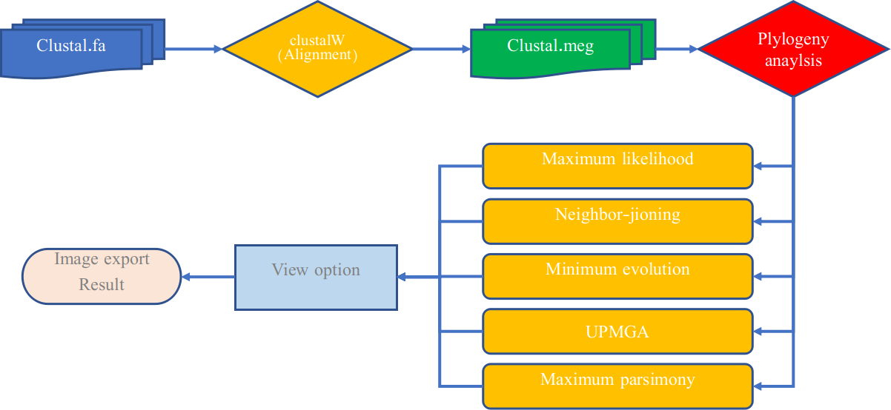
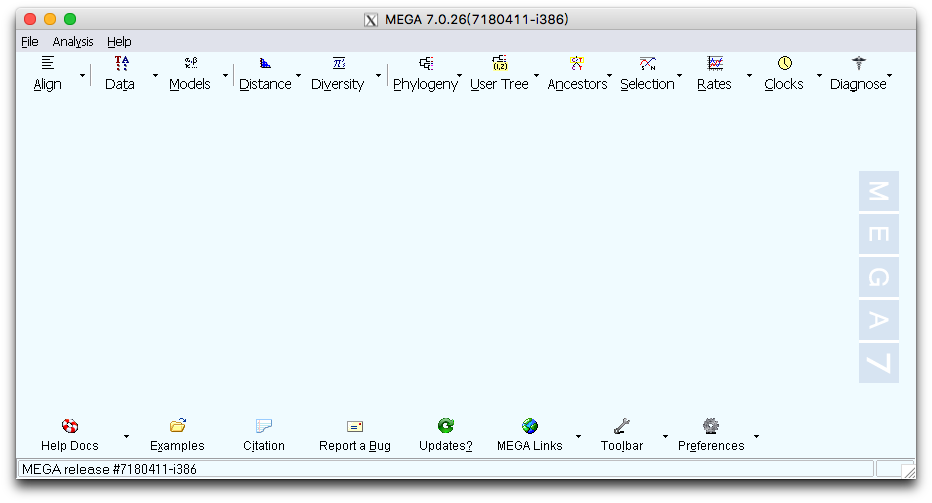
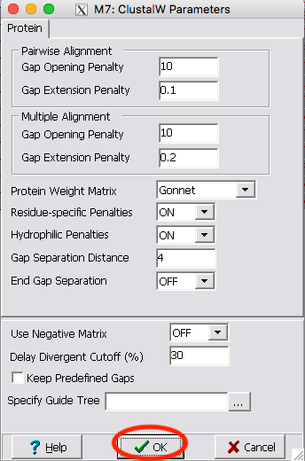
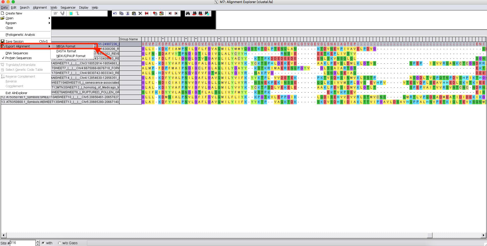
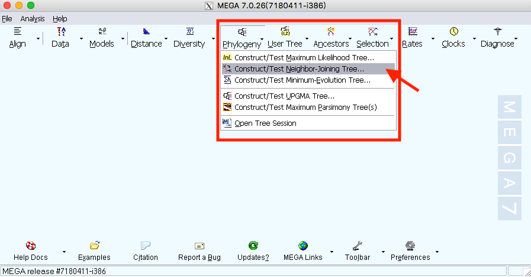
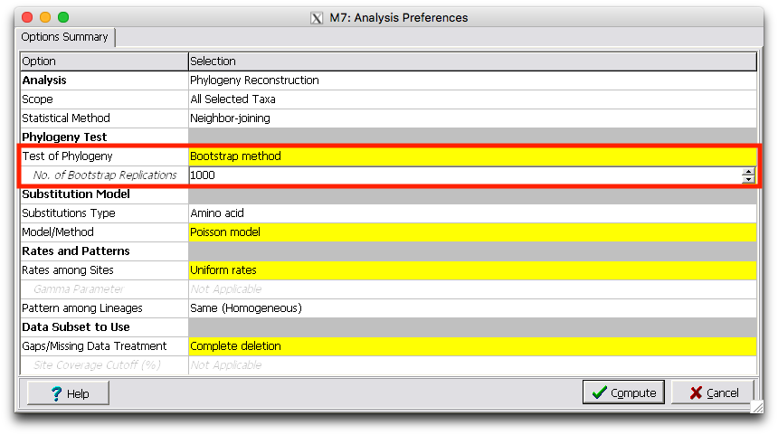
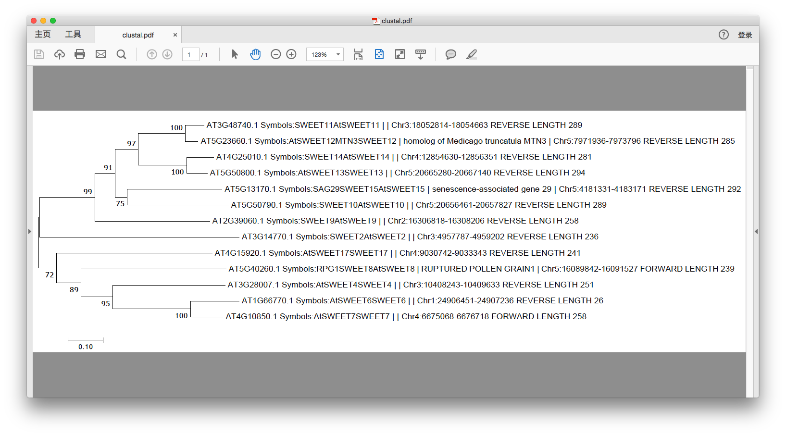
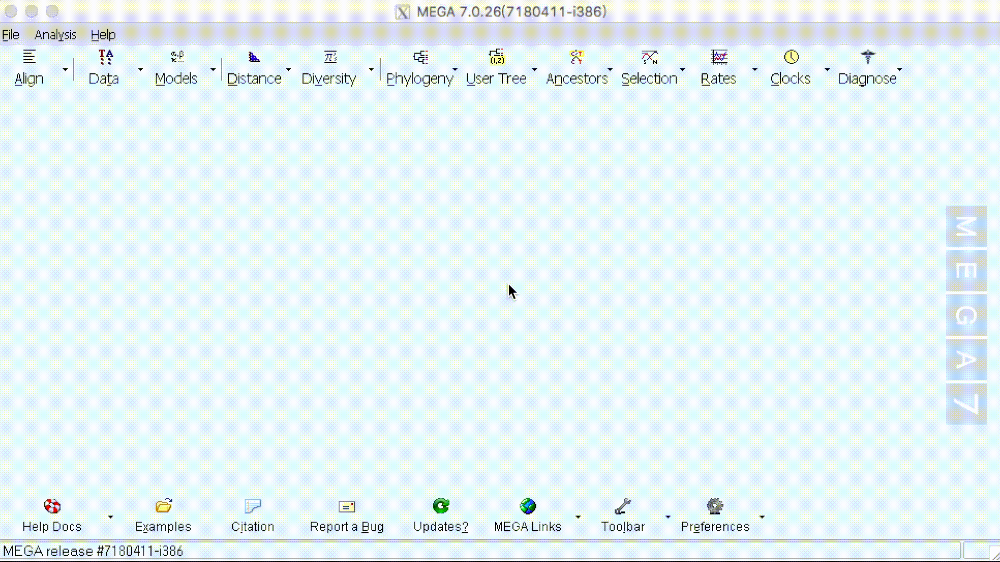

# 2.Conservation Analysis

## 0\) Files Needed 

直接下载

* 本章不需要使用docker，请直接下载教程所需文件：[Download Link](https://github.com/lulab/teaching_book/tree/master/files/PART_II/conservation)

## 1\) Pipeline

## 2\) Data Structure

### 2a\) getting software & data

* 程序下载与安装：进入 [MEGA官方网站](http://www.megasoftware.net/) ，分别下载并安装与计算机操作系统（MacOS、Windows、Linux等）相应的软件版本。目前推出了MEGA7.0版本，本节主要介绍这种软件最新版本构建系统进化树的方法。  
* 准备材料：按照 [0\) Files Needed ](#files)所示下载已经准备好的拟南芥SWEET家族Protein序列的fasta格式文件，“clustal.fa”。

### 2b\) Inputs

| Format | Description | Notes |
| :--- | :--- | :--- |
| fasta | 多个蛋白序列或核酸序列的集合 | 用于进行序列比对分析 |
| mega | MEGA软件进行序列分析结果 | 用于MEGA软件系统发育树构建 |

### 2c\) Outputs

| Format | Description | Notes |
| :--- | :--- | :--- |
| mega | MEGA软件进行序列分析的结果 | 用于MEGA软件系统发育树构建 |
| EMF | 发育树导出格式之一 | 独立的格式，可以保持图形精度 |
| PNG | 发育树导出格式之一 | 位图文件格式，图片存在压缩，可用多种浏览或编辑软件打开 |
| TIFF | 发育树导出格式之一 | 文图文件格式，印刷常用的图像文件格式 |
| PDF | 发育树导出格式之一 | 常用的文档格式 |

## 3\) Running Steps

MEGA7.0分析流程如下

### 3a\) 打开软件

双击MEGA程序图标，打开程序，如图3-1所示。

### 3b\) 打开序列文件

点击“File”菜单，选择“open a file/session···“，在对话框中找到准备好的 `clustal.fa` 文件，打开，出现对话框（如图3-2所示），选择“align”进行比对，打开序列比对窗口（如图3-3所示）。

### 3c\) 进行多序列比对分析

选中所有序列，选择 `Alignment` 菜单中 `Align by ClustalW` 选项（如图3-4 所示），用ClustalW程序进行多序列比对，弹出参数设置对话框（如图3-5 所示），使用默认参数，按“OK”键开始比对。比对结束后，选择 `Data` 菜单中 `Export Alignment` -&gt; `MEGA format` 选项（如图3-6 所示），将多序列比对结果导出为MEGA格式保存，保存为 `clustal.meg` 备用，关闭序列比对窗口。

### 3d\) 对序列进行发育树分析

回到MEGA主窗口，选择“Plylogeny”按钮，从中选择构建系统发育树的方法，这里以最邻近法为例，进行介绍（如图3-7 所示）。打开前一阶段生成的clustal.meg，弹出“Anaylsis Preferences”对话框（如图3-8 所示），可以对发育树分析的一些参数进行设置。通常情况下，我们修改“Test of Phylogeny”选项，改为“Bootstrap method”方法，然后修改“No. of Bootstrap Replication”为1000，即重抽样的重复数为1000.其他设置均为默认。

 

>BOOTSTRAP值即自展值，可用来检验所计算的进化树分支可信度。Bootstrap几乎是构建系统进化树一个必须的选项。一般Bootstrap的值>70%，则认为构建的进化树较为可靠。如果Bootstrap的值太低，则有可能进化树的拓扑结构有错误，进化树是不可靠的。

### 3e\) 个性化视图设置和结果导出

程序运行结束后，弹出“TreeExplorer”窗口（如图3-9 所示），窗口内显示构建的发育树。可以通过“View”菜单下的子菜单，对发育树进行修改。例如“view&gt;option”菜单（图3-10）所示，可以设置不同类型的发育树的枝长，间距，标签的类型和颜色等。最后，将设置完成的发育树，通过“Image”菜单，可以导出EMF、TIFF、PNG或PDF格式（如图3-11所示）。

## 4\) 分析流程动画版 

另外，我们为上文的分析流程制作了动画，如下所示：

### 4a) 导入fasta文件

### 4b) 多序列比对

### 4c) 发育树构建

### 4d) 个性化设置与结果导出

## 5\) Homework

* 按照 [0\) Files Needed ](#files)所示下载准备好的作业文件（NPF.fa），里面是几种代表性作物的NPF家族部分基因的CDS序列集合。请根据操作流程的指示，使用距离法、最大简约法和最大似然法进行系统发育树（1000 Bootstrap）的构建，并以PDF或图片的形式保留最终结果。

* 回答下列问题：

（1）试结合最终结果，解释original tree和Bootstrap consensus tree之间的区别；

（2）从构建原理的角度，简单解释不同构建方法所需时间有较大差异的原因。

（3）以同样的方法分析同样的数据，所产生的树有可能存在不同吗？为什么？

## 6\) More Reading

### 其它进化分析软件

目前构建系统进化树的软件和算法有很多，在维基百科中的列举 [List of phylogenetics software](https://en.wikipedia.org/wiki/List_of_phylogenetics_software) 就多达60种以上。下表列举了现在几种常用软件，其中 MEGA 是最主流的进化分析软件。

**分子进化与系统发育主要分析软件:**

| 软件名称 |                        网址 | 说明 |
| :---: | :--- | :--- |
| MEGA | [http://www.megasoftware.net/](http://www.megasoftware.net/) | 美国宾夕法尼亚州立大学Masatoshi Nei开发的分子进化遗传学分析软件 |
| PHYLIP | [http://evolution.genetics.washington.edu/phylip.html](http://evolution.genetics.washington.edu/phylip.html) | 美国华盛顿大学Felsenstein开发的一套集成的进化分析工具 |
| PAML | [http://abacus.gene.ucl.ac.uk/software/paml.html](http://abacus.gene.ucl.ac.uk/software/paml.html) | 英国University College London开发，采用最大似然法构树和分子进化模型 |
| PAUP | [http://paup.csit.fsu.edu/](http://paup.csit.fsu.edu/) | 国际上最通用的系统树构建软件之一，美国Smithsonion Insitute 开发 |
| RAxML | [http://sco.h-its.org/exelixis/web/software/raxml/index.html](http://sco.h-its.org/exelixis/web/software/raxml/index.html) | 大量数据的最大似然法建树常用方法（软件获取地址：[https://github.com/stamatak/standard-RAxML）](https://github.com/stamatak/standard-RAxML）) |
| MrBayes | [http://mrbayes.sourceforge.net/](http://mrbayes.sourceforge.net/) | 基于贝叶斯方法的建树工具 |
