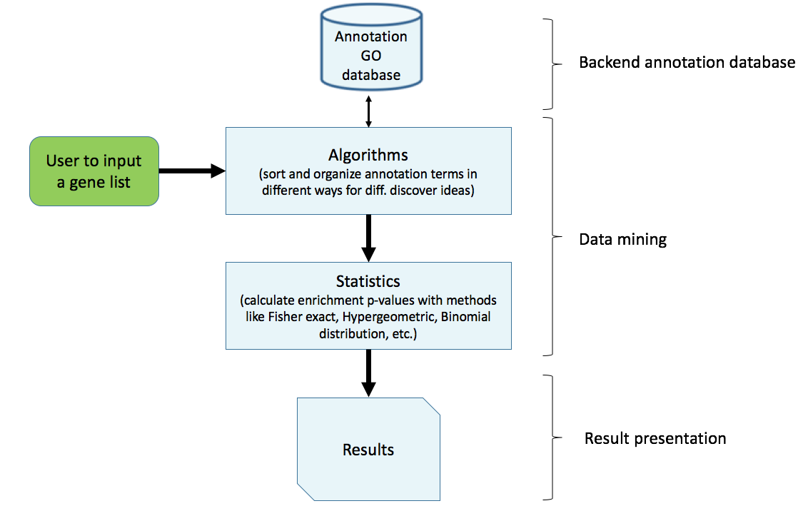
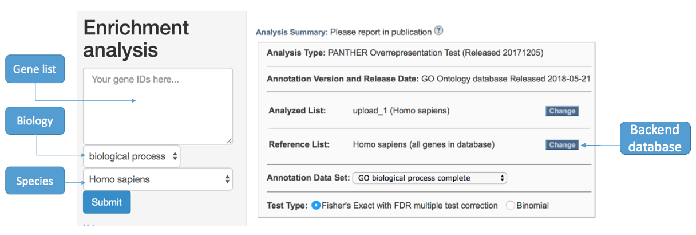
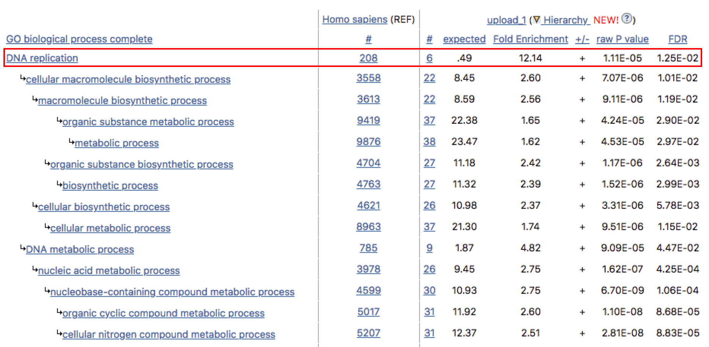
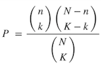

# 3.1 GO

## 1\) Pipeline



## 2\) Data Structure

参考 [文件获取方式](README.md#files)下载 GO\_gene.txt 文件, 其内容如下所示，包含了很多基因的ID：

```text
ENSG00000001036
ENSG00000003756
ENSG00000008018
ENSG00000012048
ENSG00000043355
ENSG00000074755
ENSG00000079616
ENSG00000089280
ENSG00000100591
ENSG00000100941
ENSG00000101109
ENSG00000101974
ENSG00000104611
ENSG00000104738
ENSG00000105738
ENSG00000113318
ENSG00000114867
ENSG00000116221
ENSG00000116857
ENSG00000117724
ENSG00000119285
ENSG00000121774
ENSG00000127663
ENSG00000127884
ENSG00000128159
ENSG00000129187
ENSG00000130640
ENSG00000131473
ENSG00000134287
ENSG00000134644
ENSG00000136628
ENSG00000137273
ENSG00000146263
ENSG00000153187
ENSG00000160285
ENSG00000164818
ENSG00000164944
ENSG00000167325
ENSG00000167548
ENSG00000170448
ENSG00000179632
ENSG00000183207
ENSG00000187954
ENSG00000196700
ENSG00000196924
ENSG00000198604
ENSG00000198886
ENSG00000198899
ENSG00000206503
ENSG00000223609
ENSG00000272822
```

### （1\) **Inputs**

| **File format** | **Information contained in file** | **File description** | **Notes** |
| :--- | :--- | :--- | :--- |
| txt | Gene encode id | The file contain the gene encode id | - |

### （2\) **Outputs**

| **File format** | **Information contained in file** | **File description** | **Notes** |
| :--- | :--- | :--- | :--- |
| txt | Output information | The gene ontology of each gene | - |

## 3\) Running Steps

open [Gene Ontology Consortium!](http://geneontology.org/page/go-enrichment-analysis)

### （1\) **Input gene name**



### （2\) **Output the results**

|  | **Reference list** | **User upload** |
| :--- | :--- | :--- |
| Mapped IDs: | 21042 out of 21042 | 50 out of 50 |
| Unmapped IDs: | 0 | 1 |
| Multiple mapping information: | 0 | 0 |

### （3\) Display the results

We only display results with False Discovery Rate (FDR) < 0.05. 



| GO term | Reference | Input number | expected | Fold Enrichment | +/- | raw P value | FDR |
| :--- | :--- | :--- | :--- | :--- | :--- | :--- | :--- |
| DNA replication | 208 | 6 | 0.49 | 12.14 | + | 1.11E-05 | 1.25E-02 |

* 通过和数据库比对，我们可以知道在数据库参考基因组中的21042基因，被注释为DNA replication 为208个，在用户上传的50个可以识别的基因中有6个基因被注释为DNA replication。

* expected 0.4942= 208\*50/21042

* Fold Enrichment 12.14=6/0.4942

* +/- 富集用“+”表示

* raw P value 可以用下面公式计算



* N: numbers of one organism's genes annotated with GO or of the user-provided background . 这里N等于21042

* n: numbers of genes mapped to the background in the query list

  . 这里n等于50

* K: numbers of genes in one GO term

  . 这里K等于208

* k: the counts of genes mapped to the GO term in the query list

  . 这里k等于6

## 4\) Tips/Utilities

[David](https://david.ncifcrf.gov/) 也常用来做GO分析。


## 5\) Homework

1. 请选取上面基因中的一个子集（建议30-50个之间），并重新进行GO enrichment的分析，看看不同子集会有什么样的结果（有些时候可能enrich不出合适的GO term）；然后从一次有效的结果中举一个 GO term 的例子，列出 expected, Fold Enrichment, raw P value等，并给出相应的统计计算公式。
2. **挑战题**：请问上面的例子中， FDR是如何计算出的。请写出公式，并解释原理。

