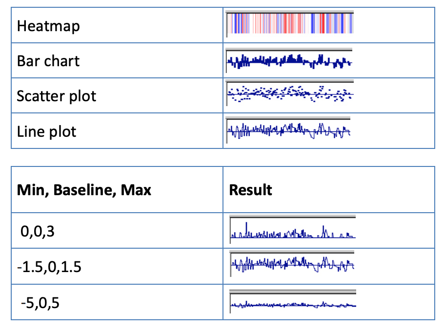
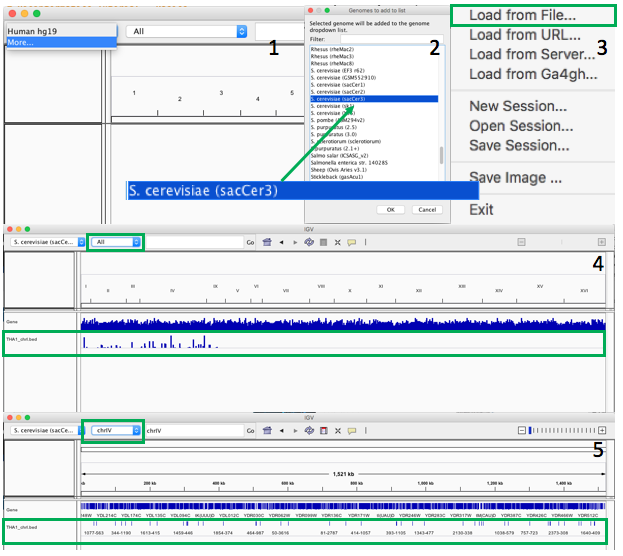
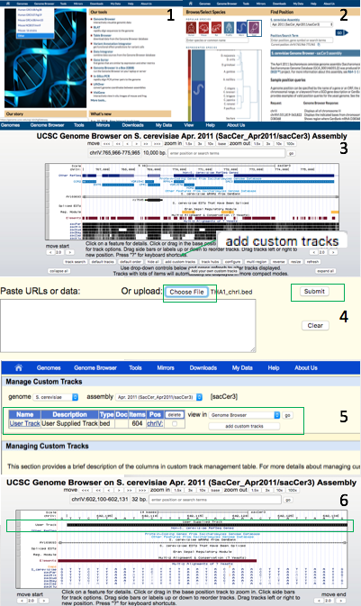

# 1.Mapping

本章中，我们将学习如何使用 bowtie 软件将高通量测序得到的 reads 比对\(mapping\)到基因组，然后再学习如何使用Genome Browser可视化基因组上的mapping结果。

## 0\) Files Needed <a id="files"></a>

### 方法1: 使用docker

docker images的下载链接如[附表](../../appendix/appendix-iv.-teaching.md#teaching-docker)所示，加载完我们提供的image后，文件都已经准备好了，可以这样查看：

```bash
cd /home/test/mapping
ls
```

**pair end mapping**
```sh
docker load -i ~/Downloads/bioinfo_pairend.tar.gz

docker run --name=bioinfo_pairend -dt -h bioinfo_docker --restart unless-stopped -v ~/Desktop/bioinfo_tsinghua_share:/home/test/share gangxu/bioinfo_pairend:1.0

docker exec -ti bioinfo_pairend

cd /home/test/pair_end_mapping
```

> 本教程docker使用方式：
>
> * 1\) 运行容器:  `docker exec -it bioinfo_tsinghua bash`
> * 2\) 进行Linux系统的相关操作
> * 3\) 退出容器：`exit`

### 方法2: 直接下载

* 如果不使用docker，也可以直接下载教程所需文件：[Download Link](https://github.com/lulab/teaching_book/tree/master/files/PART_III/1.mapping)

> 注：
>
> 除了需要下载上面链接中的fasta和fq文件，还需要从 [这里](http://bowtie-bio.sourceforge.net/tutorial.shtml) 下载 bowtie已经index好的Yeast和 e.coli 的基因组文件。
>
> 在 Docker 中，index好的基因组文件被放在了 `/home/test/mapping/BowtieIndex` 和 `/home/test/mapping/bowtie-src/indexes`中。

## 1\) Pipeline


## 2\) Data Structure

### 2a\) input

| Format | Description | Notes |
| :--- | :--- | :--- |
| `.fq` | 存储 raw reads | FASTQ Format |

例如：

```text
@EAS54_6_R1_2_1_413_324
CCCTTCTTGTCTTCAGCGTTTCTCC
+
;;3;;;;;;;;;;;;7;;;;;;;88
```

> FASTQ format stores sequences and Phred qualities in a single file. It is concise and compact. FASTQ is first widely used in the Sanger Institute and therefore we usually take the Sanger specification as the standard FASTQ format, or simply FASTQ format. Although Solexa/Illumina read file looks pretty much like FASTQ, they are different in that the qualities are scaled differently. In the quality string, if you can see a character with its ASCII code higher than 90, probably your file is in the Solexa/Illumina format.

### 2b\) output

| Format | Description | Notes |
| :--- | :--- | :--- |
| `.sam` | mapping 结果 | - |
| `.bed` | Tab分隔， 便于其它软件\(例如 IGB \)处理 | - |

bed文件格式：

1. chrom： The name of the chromosome \(e.g. chr3, chrY, chr2\_random\) or scaffold \(e.g. scaffold10671\).
2. chromStart： The starting position of the feature in the chromosome or scaffold. The first base in a chromosome is numbered 0.
3. chromEnd： The ending position of the feature in the chromosome or scaffold. The chromEnd base is not included in the display of the feature. For example, the first 100 bases of a chromosome are defined as chromStart=0, chromEnd=100, and span the bases numbered 0-99.
4. name \(optional\): Defines the name of the BED line. This label is displayed to the left of the BED line in the Genome Browser window when the track is open to full display mode or directly to the left of the item in pack mode.
5. score \(optional\): A score between 0 and 1000. 

## 3\) Running Steps

首先进入到docker容器（在自己电脑的 Terminal/Powershell 中运行）：

```bash
docker exec -it bioinfo_tsinghua bash
```

以下步骤均在 `/home/test/mapping/` 下进行:

```bash
cd /home/test/mapping/
```

### 3a\) mapping

```bash
bowtie -v 2 -m 10 --best --strata BowtieIndex/YeastGenome -f THA1.fa -S THA1.sam

bowtie -v 1 -m 10 --best --strata bowtie-src/indexes/e_coli \
    -q e_coli_1000_1.fq -S e_coli_1000_1.sam
```

* `-v`  report end-to-end hits with less than v mismatches; ignore qualities
* `-m`  suppress all alignments if more than m exist \(def: no limit\) 
* `-M`  like `-m`, but reports 1 random hit \(MAPQ=0\) \(requires `--best`\)
* `--best` hits guaranteed best stratum; ties broken by quality
* `--strata` hits in sub-optimal strata aren't reported \(requires `--best`\)
* `-f` raw reads文件 \(FASTA\) 
* `-q` raw reads 文件（FASTQ\)    
* `-S` 输出文件名，格式为 `.sam` 格式 

### 3b\) 格式转化

这里我们将 `.sam` 处理成 `.bed` 格式，方便后续可视化处理。

```bash
perl sam2bed.pl THA1.sam > THA1.bed
```

我们之后可以可视化比对出的结果。常用的软件和网站包括[IGV](https://software.broadinstitute.org/software/igv/download)和[UCSC](https://genome.ucsc.edu/cgi-bin/hgTracks)。

### 3c\) 过滤文件

上传 `.bed` 文件到 Genome Browser 浏览时，如果文件过大，或者MT染色体不识别，可以用如下方法：

```bash
grep -v chrmt THA1.bed > THA1_new.bed   #输出一个不含chromosome MT的文件

grep $'chrIV\t' THA1.bed > THA1_chrIV.bed      #输出一个只有chromosome IV的文件


# 将文件拷入共享文件夹下面，文件就共享在桌面下的 bioinfo_tsinghua_share （如果有问题，请看Getting Started 创建并运行容器）
cp THA1_new.bed /home/test/share
cp THA1_chrIV.bed /home/test/share
```

## 4\) Genome Browser

在生物信息学中，基因组浏览器是用于显示来自生物学数据库的基因组数据的信息的图形界面。基因组浏览器使研究人员能够使用注释数据对整个基因组进行可视化和浏览，包括基因预测和结构，蛋白质，表达，调控，变异，比较分析等。注释数据通常来自多种不同的来源。

基因组浏览器是高通量测序分析的一个重要的可视化工具。相比于最终提供的表格，基因组浏览器可以提供更多的信息，如直观展示突变位点、查看有无新转录本或新的可变剪接形式、查看peak的可信度、上下游基因、区域保守性、重复元件、蛋白结合motif等。

基因组浏览器都可以按照位置或基因名字搜索，可进行局部放大和缩小。虽然每个软件略有不同，但基本操作是通用的。点一点，拽一拽，就都能用了。初次接触一个软件，多一点耐心，多一点操作，其实没那么难。

### 4a\) IGV genome browser app

* 从[IGV官网](http://software.broadinstitute.org/software/igv/download)下载APP;
* 演示视频  [@youtube](https://youtu.be/6_1ZcVw7ptU) [@bilibili](https://www.bilibili.com/video/av30448472/)

Integrative Genomics Viewer\(IGV\)是一个强大的基因组可视化工具，可以交互式的查看大多数的基因组相关数据，并且支持多种NGS测序数据类型。在大多数NGS数据分析中都会涉及到分析数据的可视化展示，IGV无疑为我们提供了一个便利的可视化途径。IGV提供了基于Java的本地版集成工具，也可以定制构建web版的IGV Browser，方便地存储并展示个人数据。

通过本教程，基本可以做到：

* 浏览不同的组学数据
* 快速探索定位基因组
* 对比对结果进行可视化
* 肉眼找找SNP/SNV以及结构变异

#### 4a.1\) 熟悉IGV


* 首先先在右上角选择**基因组版本**，默认情况下会加载hg19，当然可以自己下载其他基因组。然后点击顶部的`file` ，选择`load from server` ，这样就会选择**额外的几条track**，比如显示Ensembl基因名、GC含量等等，这一部分值得慢慢探索。


* 它的右侧默认显示`All` ，表示**全部染色体**。可以选择某一条特定染色体\(这里先选择Chr1\)

* 再向右的长框是**具体的区间**，输入`chr1:10,000-11,000` 表示从10000bp开始数显示1000bp长度的区间（注意是英文状态的冒号），然后点击`Go`。

* **侧边是track**（意为："轨道“、”跑道“），文件类型决定track的类型，track类型又决定了显示的方式，如峰图、线图、柱状图等。不同的track被加载进来时，它们是层层叠加的，可以利用左侧的track名称进行区分。



* 推荐的**文件类型**：[http://software.broadinstitute.org/software/igv/RecommendedFileFormats](http://software.broadinstitute.org/software/igv/RecommendedFileFormats)

> 其中规定比对的数据：SAM format \(**must be sorted**\), BAM format \(**must be sorted and indexed**\)



#### 4a.2\) 定位导航

**粗略定位**

输入`chr1:10,000-11,000` ，就将这1000bp的区间显示出来，还将序列显示为有颜色的长条，sequence顶部一行为碱基序列，其中A为绿色，C为蓝色，G是橙色，T是红色，这样利用颜色方便了识别重复序列；

另外它的下方几行是翻译的氨基酸序列，其中绿色表示蛋氨酸，红色为终止密码子，通过点击顶部那一行可以选择隐藏或显示氨基酸序列


**如何看的更精细？**

然后看右上角的`+` ，可以缩放，让我们看碱基看的更清楚，直到单碱基水平，它会先从基因开始显示，当放大到一定程度时，序列信息就展示出来\(看来自官网的解释：[https://software.broadinstitute.org/software/igv/sequence\_track\_options](https://software.broadinstitute.org/software/igv/sequence_track_options)\)


> 注意：sequence旁边的**黑色粗箭头**是可以点击的，点一下箭头方向会发生改变。箭头的方向表示当前展示的链，箭头向左为负链，会显示互补碱基信息以及反向互补的翻译信息

**另外除了根据位置去定位，还支持根据基因名去定位**

\(只要之前添加了基因名的注释track\)，例如直接在长条框中输入`BRCA1`


另外，定位到基因后，还可以看看两个相邻基因有什么区别：

比如可以看到：BRCA1和NBR2两个基因方向相反，BRCA1的第一个外显子在最右侧


**基因是用线和条形描绘的**

横线表示内含子区域，竖条表示外显子区域，箭头表示基因转录的方向或者说转录的链。高的竖条表示外显子的CDS区域，矮的竖条是UTR。图中表示的是3’=》5‘方向，基因也是在负链，5’UTR在左侧，3‘UTR在右侧


\(颜色不用管，都是自己可以设置的：右键track=》change track color\)

再看一个例子：


\(在biostar的解释：[https://www.biostars.org/p/105248/](https://www.biostars.org/p/105248/)\)

结合IGV理解这句话：

> **外显子与内含子的邻接部位**是一段高度保守的序列：外显子尾巴与下一个内含子的头部多数是GT，内含子的尾巴与下一个外显子的头部多数是AG，可以简单记做`GT-AG`法则，作为**RNA剪切的识别信号**


#### 4a.3\)  为检索区域添加书签

有时想保存当前的搜索区域，有点像浏览器的书签功能，可以利用`Regions` 的`Region Navigator`功能，当进行全局浏览时，可以边看边点击`add` 来添加


### 4b\) UCSC genome browser on line

* [UCSC genome browser官方网页](https://genome.ucsc.edu/)
* **演示视频** [@youtube](https://youtu.be/eTgEtfI65hA) [@bilibili](https://www.bilibili.com/video/av30448417/)



> **Tips**：
>
> 1. 对于处理好的测序数据（bigWig, BAM, bigBed\)，UCSC仅支持通过提供URL链接或直接输入。
> 2. 在比较不同样本的数据时，需要根据样本本身测序深度的不同来对纵坐标进行调整,从而保证该区域/位点测序数据能够显示完整并且可以相互比较。
> 3. 有时，用 `bedtools genomecov -scale` 之后的 bigwig 文件纵坐标仍然会出现显示不完整等现象，此时需要手动调整下。

## 5\) Tips

### \(1\) 更多基因组文件格式

详见 [http://genome.ucsc.edu/FAQ/FAQformat.html](http://genome.ucsc.edu/FAQ/FAQformat.html)。
### \(2\) mapping pair-end reads

```bash
cd /home/test/pair_end_mapping
STAR --genomeDir ./STAR_TAIR10_index --readFilesIn Ath_1.fq Ath_2.fq --outFileNamePrefix ./output/ --outSAMtype BAM SortedByCoordinate

```

* `--genomeDir`  specifies path to the genome directory where genome indices where generated.

* `--readFilesIn`  name(s) (with path) of the files containing the sequences to be mapped (e.g.
RNA-seq FASTQ files). If using Illumina paired-end reads, the read1 and read2 files have to
be supplied. 

* `--outFileNamePrefix`  all output files are written in the current directory.

* `--outSAMtype BAM SortedByCoordinate` output sorted by coordinate, similar to samtools sort command.


## 6\) Homework

> 需要提交各步骤代码并汇报最后一步输出文件的行数。
>
> 作业所需文件见 [Files Needed](https://github.com/lulab/teaching_book/tree/master/files/PART_III/1.mapping)

1. 将 `THA2.fa` map 到 `BowtieIndex/YeastGenome` 上，得到 `THA2.sam`。
2. 将 `e_coli_500.fq` map 到 `bowtie-src/indexes/e_coli` 上，得到 `e_coli_500.sam`。
3. 将上面两个结果均转换为 `.bed` 文件。
4. 从上一步得到的 `THA2.bed` 中筛选出 
   * 一个不含chromosome V 的文件
   * 一个只有chromosome XII 的文件 

## 7) More Reading

如上所述，mapping本身的步骤不多，但更关键和需要经验的步骤其实是在mapping前对**raw reads的clean和QC工作**，例如，对各种adaptor(linker)的移除、对质量不好的raw reads的trim和丢弃。

**这需要对不同基因组测序protocol的清晰了解，需要长时间的学习和积累。**illumina团队把现有的所有二代测序建库技术都收集并整理成标准，免费查看。这是Sequence Method Explorer的网址：

[English Version](https://www.illumina.com/science/sequencing-method-explorer.html) \| [中文版](https://www.illumina.com.cn/science/sequencing-method-explorer.html?langsel=/cn/)


## 休息一会

**Illumina & Affymetrix**


> “Illumina公司的市场数据实在是非常美妙的东西。”拥有个人博客的基因研究人员丹尼尔·麦克阿瑟（Daniel Macarthur）说，“它是如此地纯净，到了令人吃惊的地步。” 当Illumina公司目前的股价净值比高达84倍的时候，高盛仍然建议买入，声称该公司很有可能继续保持其在DNA测序领域里的领导地位。

Illumina毫无疑问是这个时代科技公司的榜样。在生物学仪器制造领域，跟Thermo，Life等拥有几十年历史的公司相比，1998年起源于加州圣地亚哥的Illumina显然还是个年轻小伙。从1999年25个人的规模、130万美元的年营业额，到2013年超过3200人的规模、14.21亿美元的年营业额。

今天，Illumina公司几乎垄断了所有的二代测序（NGS：Next Generation Sequencing）市场。但是，Illumina公司最初是一家生产DNA芯片（microarray chip\)的公司，这是一种侦测DNA变异的早期技术。而且，那时的Illumina公司还落后于该市场缔造者Affymetrix公司。

Illumina今天已经赶超了Affymetrix，并将其远远抛之脑后。最主要的原因，在于它从DNA芯片到DNA测序上的成功转型。Illumina公司的成功，很多人归功于其CEO，Jay Flatley，在战略上的敏锐。他很可能称得上是生物科技领域里的最佳CEO。2006年，Flatley说服Illumina公司董事会以6亿美元的价格收购了一家叫Solexa的开发NGS技术的小公司（同类型的NGS技术公司还有454等，因为其技术、成本和市场上的弱势，今天已经很少有人听说了），借此大力押注DNA测序。

如今，illumina在二代测序（NGS：Next Generation Sequencing）乃至整个测序市场占据领导地位。引用illumina官方说法：“世界上90%以上的测序数据都由illumina仪器产生”，不较真的话，这句话确实在某种程度上反应了illumina雄踞NGS市场的现状（下图是illumina 测序产品发布时间线） 。尤其是HiSeq系列测序仪的问世，以通量高，产量大，生产规模著称，能够快速、经济的进行大规模平行测序，在大型全基因组测序，全转录组，全外显子组测序，靶向基因测序方面优势明显。


