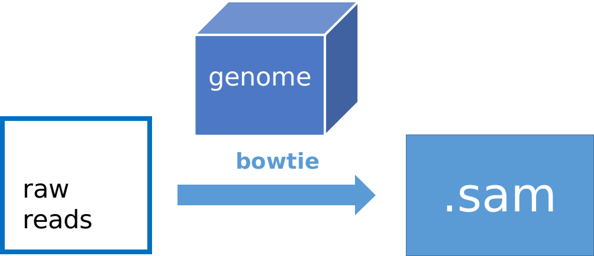

# 1.Mapping

本章中，我们将学习如何使用 bowtie 软件将高通量测序得到的 reads 比对\(mapping\)到基因组，然后再学习如何使用Genome Browser可视化基因组上的mapping结果。

## 0\) Files Needed <a id="files"></a>

### 方法1: 使用docker

docker images的下载链接如[附表](../../appendix/appendix-iv.-teaching.md#teaching-docker)所示，加载完我们提供的image后，文件都已经准备好了，可以这样查看：

```bash
cd /home/test/mapping
ls
```

> 本教程docker使用方式：
>
> * 1\) 运行容器:  `docker exec -it bioinfo_tsinghua bash`
> * 2\) 进行Linux系统的相关操作
> * 3\) 退出容器：`exit`

### 方法2: 直接下载

* 如果不使用docker，也可以直接下载教程所需文件：[Download Link](https://github.com/lulab/teaching_book/tree/master/files/PART_III/1.mapping)

> 注：
>
> 除了需要下载上面链接中的fasta和fq文件，还需要从 [这里](http://bowtie-bio.sourceforge.net/tutorial.shtml) 下载 bowtie已经index好的Yeast和 e.coli 的基因组文件。
>
> 在 Docker 中，index好的基因组文件被放在了 `/home/test/mapping/BowtieIndex` 和 `/home/test/mapping/bowtie-src/indexes`中。

## 1\) Pipeline



## 2\) Data Structure

### 2a\) input

| Format | Description | Notes |
| :--- | :--- | :--- |
| `.fq` | 存储 raw reads | FASTQ Format |

例如：

```text
@EAS54_6_R1_2_1_413_324
CCCTTCTTGTCTTCAGCGTTTCTCC
+
;;3;;;;;;;;;;;;7;;;;;;;88
```

> FASTQ format stores sequences and Phred qualities in a single file. It is concise and compact. FASTQ is first widely used in the Sanger Institute and therefore we usually take the Sanger specification as the standard FASTQ format, or simply FASTQ format. Although Solexa/Illumina read file looks pretty much like FASTQ, they are different in that the qualities are scaled differently. In the quality string, if you can see a character with its ASCII code higher than 90, probably your file is in the Solexa/Illumina format.

### 2b\) output

| Format | Description | Notes |
| :--- | :--- | :--- |
| `.sam` | mapping 结果 | - |
| `.bed` | Tab分隔， 便于其它软件\(例如 IGB \)处理 | - |

bed文件格式：

1. chrom： The name of the chromosome \(e.g. chr3, chrY, chr2\_random\) or scaffold \(e.g. scaffold10671\).
2. chromStart： The starting position of the feature in the chromosome or scaffold. The first base in a chromosome is numbered 0.
3. chromEnd： The ending position of the feature in the chromosome or scaffold. The chromEnd base is not included in the display of the feature. For example, the first 100 bases of a chromosome are defined as chromStart=0, chromEnd=100, and span the bases numbered 0-99.
4. name \(optional\): Defines the name of the BED line. This label is displayed to the left of the BED line in the Genome Browser window when the track is open to full display mode or directly to the left of the item in pack mode.
5. score \(optional\): A score between 0 and 1000. 

## 3\) Running Steps

首先进入到docker容器（在自己电脑的 Terminal/Powershell 中运行）：

```bash
docker exec -it bioinfo_tsinghua bash
```

以下步骤均在 `/home/test/mapping/` 下进行:

```bash
cd /home/test/mapping/
```

### 3a\) mapping

```bash
bowtie -v 2 -m 10 --best --strata BowtieIndex/YeastGenome -f THA1.fa -S THA1.sam

bowtie -v 1 -m 10 --best --strata bowtie-src/indexes/e_coli \
    -q e_coli_1000_1.fq -S e_coli_1000_1.sam
```

* `-v`  report end-to-end hits with less than v mismatches; ignore qualities
* `-m`  suppress all alignments if more than m exist \(def: no limit\) 
* `-M`  like `-m`, but reports 1 random hit \(MAPQ=0\) \(requires `--best`\)
* `--best` hits guaranteed best stratum; ties broken by quality
* `--strata` hits in sub-optimal strata aren't reported \(requires `--best`\)
* `-f` raw reads文件 \(FASTA\) 
* `-q` raw reads 文件（FASTQ\)    
* `-S` 输出文件名，格式为 `.sam` 格式 

### 3b\) 格式转化

这里我们将 `.sam` 处理成 `.bed` 格式，方便后续可视化处理。

```bash
perl sam2bed.pl THA1.sam > THA1.bed
```

我们之后可以可视化比对出的结果。常用的软件和网站包括[IGV](https://software.broadinstitute.org/software/igv/download)和[UCSC](https://genome.ucsc.edu/cgi-bin/hgTracks)。

### 3c\) 过滤文件

上传 `.bed` 文件到 Genome Browser 浏览时，如果文件过大，或者MT染色体不识别，可以用如下方法：

```bash
grep -v chrmt THA1.bed > THA1_new.bed   #输出一个不含chromosome MT的文件

grep $'chrIV\t' THA1.bed > THA1_chrIV.bed      #输出一个只有chromosome IV的文件


# 将文件拷入共享文件夹下面，文件就共享在桌面下的 bioinfo_tsinghua_share （如果有问题，请看Getting Started 创建并运行容器）
cp THA1_new.bed /home/test/share
cp THA1_chrIV.bed /home/test/share
```

## 4\) Genome Browser

see [more details](1.1-genome-browser.md)

## 5\) Tips

### \(1\) 更多基因组文件格式

详见 [http://genome.ucsc.edu/FAQ/FAQformat.html](http://genome.ucsc.edu/FAQ/FAQformat.html)。

### \(2\) mapping paired-end reads

我们为paired-end reads maping 专门提供了一个docker （下载链接如[附表](../../appendix/appendix-iv.-teaching.md#teaching-docker)所示）。

* 首先，加载docker：

```bash
docker load -i ~/Downloads/bioinfo_pairend.tar.gz
docker run --name=bioinfo_pairend -dt -h bioinfo_docker --restart unless-stopped -v ~/Desktop/bioinfo_tsinghua_share:/home/test/share gangxu/bioinfo_pairend:1.0
docker exec -ti bioinfo_pairend
cd /home/test/pair_end_mapping
```

* 然后，可以开始进行mapping：

```bash
cd /home/test/pair_end_mapping
STAR --genomeDir ./STAR_TAIR10_index --readFilesIn Ath_1.fq Ath_2.fq --outFileNamePrefix ./output/ --outSAMtype BAM SortedByCoordinate
```

> * `--genomeDir`  specifies path to the genome directory where genome indices where generated.
> * `--readFilesIn`  name\(s\) \(with path\) of the files containing the sequences to be mapped \(e.g.
>
>   RNA-seq FASTQ files\). If using Illumina paired-end reads, the read1 and read2 files have to
>
>   be supplied. 
>
> * `--outFileNamePrefix`  all output files are written in the current directory.
> * `--outSAMtype BAM SortedByCoordinate` output sorted by coordinate, similar to samtools sort command.

## 6\) Homework

> 需要提交各步骤代码并汇报最后一步输出文件的行数。
>
> 作业所需文件见 [Files Needed](https://github.com/lulab/teaching_book/tree/master/files/PART_III/1.mapping)

1. 将 `THA2.fa` map 到 `BowtieIndex/YeastGenome` 上，得到 `THA2.sam`。
2. 将 `e_coli_500.fq` map 到 `bowtie-src/indexes/e_coli` 上，得到 `e_coli_500.sam`。
3. 将上面两个结果均转换为 `.bed` 文件。
4. 从上一步得到的 `THA2.bed` 中筛选出 
   * 一个不含chromosome V 的文件
   * 一个只有chromosome XII 的文件 

## 7\) More Reading

如上所述，mapping本身的步骤不多，但更关键和需要经验的步骤其实是在mapping前对**raw reads的clean和QC工作**，例如，对各种adaptor\(linker\)的移除、对质量不好的raw reads的trim和丢弃。

**这需要对不同基因组测序protocol的清晰了解，需要长时间的学习和积累。**illumina团队把现有的所有二代测序建库技术都收集并整理成标准，免费查看。这是Sequence Method Explorer的网址：

[English Version](https://www.illumina.com/science/sequencing-method-explorer.html) \| [中文版](https://www.illumina.com.cn/science/sequencing-method-explorer.html?langsel=/cn/)

## 休息一会

**Illumina & Affymetrix**


> “Illumina公司的市场数据实在是非常美妙的东西。”拥有个人博客的基因研究人员丹尼尔·麦克阿瑟（Daniel Macarthur）说，“它是如此地纯净，到了令人吃惊的地步。” 当Illumina公司目前的股价净值比高达84倍的时候，高盛仍然建议买入，声称该公司很有可能继续保持其在DNA测序领域里的领导地位。

Illumina毫无疑问是这个时代科技公司的榜样。在生物学仪器制造领域，跟Thermo，Life等拥有几十年历史的公司相比，1998年起源于加州圣地亚哥的Illumina显然还是个年轻小伙。从1999年25个人的规模、130万美元的年营业额，到2013年超过3200人的规模、14.21亿美元的年营业额。

今天，Illumina公司几乎垄断了所有的二代测序（NGS：Next Generation Sequencing）市场。但是，Illumina公司最初是一家生产DNA芯片（microarray chip\)的公司，这是一种侦测DNA变异的早期技术。而且，那时的Illumina公司还落后于该市场缔造者Affymetrix公司。

Illumina今天已经赶超了Affymetrix，并将其远远抛之脑后。最主要的原因，在于它从DNA芯片到DNA测序上的成功转型。Illumina公司的成功，很多人归功于其CEO，Jay Flatley，在战略上的敏锐。他很可能称得上是生物科技领域里的最佳CEO。2006年，Flatley说服Illumina公司董事会以6亿美元的价格收购了一家叫Solexa的开发NGS技术的小公司（同类型的NGS技术公司还有454等，因为其技术、成本和市场上的弱势，今天已经很少有人听说了），借此大力押注DNA测序。

如今，illumina在二代测序（NGS：Next Generation Sequencing）乃至整个测序市场占据领导地位。引用illumina官方说法：“世界上90%以上的测序数据都由illumina仪器产生”，不较真的话，这句话确实在某种程度上反应了illumina雄踞NGS市场的现状（下图是illumina 测序产品发布时间线） 。尤其是HiSeq系列测序仪的问世，以通量高，产量大，生产规模著称，能够快速、经济的进行大规模平行测序，在大型全基因组测序，全转录组，全外显子组测序，靶向基因测序方面优势明显。


