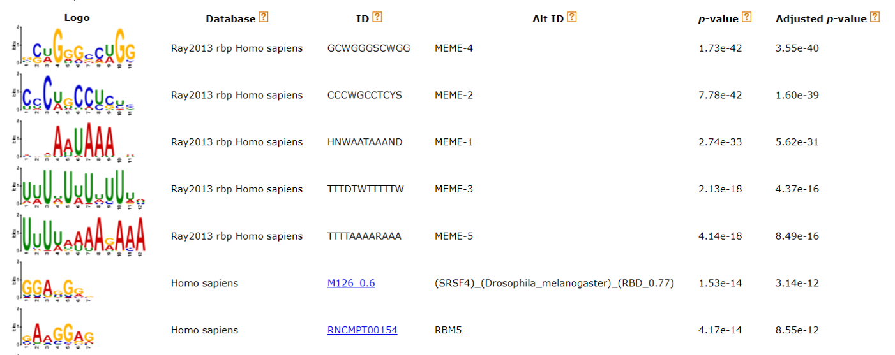

# 5.1.Sequence Motif

## 1\) workflow


## 2\) running steps

### \(1\) get UTR or promoter sequence

#### install R package GenomicFeatures and biozhuoer tools \(cnode\)

GenomicFeatures package used to extract needed sequence

biozhuoer tools used to concat sequences of the same UTR or promoter

```text
source("http://www.bioconductor.org/biocLite.R")
biocLite("GenomicFeatures")
library(GenomicFeatures)

if (!('devtools' %in% .packages(T))) install.packages('devtools');
devtools::install_github('dongzhuoer/biozhuoer');
```

#### generate txdb object

There are many functions for us to get genme annotation file:

```text
gtf_file="/BioII/lulab_b/shared/genomes/human_hg38/anno/gtf/gencode.v27.annotation.gtf"
txdb <- makeTxDbFromGFF(gtf_file, format="gtf")
```

#### get 3'UTR & 5'UTR site range

```text
utr5p = fiveUTRsByTranscript(txdb, use.names=T)
utr3p = threeUTRsByTranscript(txdb, use.names=T)

utr3p.df=as.data.frame(utr3p)
utr5p.df=as.data.frame(utr5p)

write.table(utr3p.df, "utr3p.info", row.names=FALSE, sep='\t',quote=FALSE )
write.table(utr5p.df, "utr5p.info", row.names=FALSE, sep='\t' ,quote=FALSE)
```

#### get promoter site range

```text
promoter=promoters(txdb)
promoter.df=as.data.frame(promoter)
write.table(promoter.df, "promoter.info", row.names=FALSE, sep='\t' ,quote=FALSE)
```

### \(2\) intersect with interested genes

#### interested 3'UTR

```text
sort -t $'\t' -k 2 utr3p.info|join -o 1.3 2.1 1.2 1.9 1.4 1.5 1.6 1.7 1.8 1.10 -t $'\t' -1 2 -2 2 - \
  <(cut -f 1 SC2_SF2.ct.dn.1_0.01.protein_coding |sort |join -t $'\t' -1 1 -2 1 - <(sort -t $'\t' -k 1 \
  <(grep -o -P -e "gene_id.*; transcript_id.*?;" /BioII/lulab_b/shared/genomes/human_hg38/anno/gtf/gencode.v27.annotation.gtf |sort |uniq|sed -e 's/gene_id "//' -e 's/"; transcript_id "/\t/' -e 's/";//'))|sort -t $'\t' -k 2  ) |\
  sort -t $'\t' -k 1 >interested_three_prime_UTR.info
```

explanation for interested\_three\_prime\_UTR.info:

```text
column1: chr
column2: gene
column3: transprict
column4: exon_name
column5: start
column6: end
column7: width(seq length)
column8: strand
column9: exon_id
column10: exon_rank
```

#### interested promoter

```text
sort -t $'\t' -k 7 promoter.info|join -o 1.1 2.1 1.7 1.2  1.3 1.4 1.5 1.6 -t $'\t' -1 7 -2 2 - \
  <(cut -f 1 SC2_SF2.ct.dn.1_0.01.protein_coding |sort |join -t $'\t' -1 1 -2 1 - \
  <(sort -t $'\t' -k 1 <(grep -o -P -e "gene_id.*; transcript_id.*?;" /BioII/lulab_b/shared/genomes/human_hg38/anno/gtf/gencode.v27.annotation.gtf |sort \
  |uniq|sed -e 's/gene_id "//' -e 's/"; transcript_id "/\t/' -e 's/";//' ))|sort -t $'\t' -k 2  ) |\
  sort -t $'\t' -k 1 >interested_promoter.info
```

explanation for interested\_promoter.info:

```text
column1: chr
column2: gene
column3: transprict
column4: start
column5: end
column6: width(seq length)
column7: strand
column8: transprict_id
```

### \(3\) convert to bed format

#### 3'UTR bed info

```text
cat interested_three_prime_UTR.info | \
  awk '{print $1 "\t" $5-1 "\t" $6 "\t" $3 "\t" $2 "\t" $8}' | \
  sort -u  > interested_three_prime_UTR.bed
```

explanation for interested\_three\_prime\_UTR.bed:

```text
column1: chr
column2: start
column3: end
column4: gene
column5: transcript
column6: strand
```

#### promoter bed info

```text
cat interested_promoter.info | \
  awk '{print $1 "\t" $4-1 "\t" $5 "\t" $3 "\t" $2 "\t" $7}' | \
  sort -u  > interested_promoter.bed
```

explanation for interested\_promoter.bed:

```text
column1: chr
column2: start
column3: end
column4: gene
column5: transcript
column6: strand
```

### \(4\) get genome sequence

#### get 3'UTR related genome sequence

```text
bedtools getfasta -s -name -fi /BioII/lulab_b/shared/genomes/human_hg38/sequence/GRCh38.p10.genome.fa \
  -bed interested_three_prime_UTR.bed -fo interested_three_prime_UTR.fa
```

#### concatenate sequences of the same 3’ UTR

```text
concatenate_seq <- function(fasta_file) {
    biozhuoer::read_fasta(fasta_file) %>% 
        dplyr::mutate(name = stringr::str_extract(name, 'ENST[\\d\\.]+')) %>% 
        dplyr::group_by(name) %>% dplyr::summarise(seq = paste0(seq, collapse = '')) %>% 
        biozhuoer::write_fasta(fasta_file)
}
concatenate_seq('interested_three_prime_UTR.fa')
```

#### get promoter related genome sequence

```text
bedtools getfasta -s -name -fi /BioII/lulab_b/shared/genomes/human_hg38/sequence/GRCh38.p10.genome.fa \
  -bed interested_promoter.bed -fo interested_promoter.fa
```

#### concatenate sequences of the same promoter

```text
concatenate_seq <- function(fasta_file) {
    biozhuoer::read_fasta(fasta_file) %>% 
        dplyr::mutate(name = stringr::str_extract(name, 'ENST[\\d\\.]+')) %>% 
        dplyr::group_by(name) %>% dplyr::summarise(seq = paste0(seq, collapse = '')) %>% 
        biozhuoer::write_fasta(fasta_file)
}
concatenate_seq('interested_promoter.fa')
```

### \(5\) generate random sequence as background sequence

there are three mothods to get random sequence: 1. shuffle the input sequence 2. downsteam 1000bp 3. bedtools shuffle

#### shuffle the input sequence

```text
fasta-shuffle-letters interested_three_prime_UTR.fa interested_three_prime_UTR.control
fasta-shuffle-letters interested_promoter.fa interested_promoter.control
```

#### downstream 1000bp as bg

[https://dongzhuoer.github.io/diff\_exp\_2018\_zhuoer/motif.html](https://dongzhuoer.github.io/diff_exp_2018_zhuoer/motif.html)

```text
slide <- function(input_bed, output_bed, n = 1000) {
    col_names <- c('chr', 'start', 'end', 'name', 'score', 'strand');

    original <- readr::read_tsv(input_bed, col_names) %>% 
        dplyr::group_by_at(-2:-3) %>% 
        dplyr::summarise(length = sum(end - start), end = max(end)) %>% 
        dplyr::ungroup()

    if (n > 0) {
       slide <- original %>% dplyr::mutate(start = end + n, end = start + length)
    } else {
       slide <- original %>% dplyr::mutate(end = start + n, start = end - length)
    }

    slide %>% dplyr::select(chr, start, end, name, score, strand) %>% 
        readr::write_tsv(output_bed, col_names = F)
}
slide('interested_three_prime_UTR.bed', 'interested_three_prime_UTR_downstream.bed')
slide('interested_promoter.bed', 'interested_promoter_downstream.bed')
```

repeat get promoter and get 3'UTR section

#### bedtools shuffle

```text
bedtools shuffle -i interested_three_prime_UTR.bed \
  -g GRCh38.p10.genome.size >interested_three_prime_UTR_btools.bed

bedtools shuffle -i interested_promoter.bed \
  -g GRCh38.p10.genome.size >interested_promoter_btools.bed
```

repeat get promoter and get 3'UTR section

### \(6\) motif enrichment

#### de novo motif discovery

```text
meme -dna -maxsize 1000000 \
  -minw 4 -maxw 12 \
  -oc promoter_de_novo \
  -nmotifs 5 \
  interested_promoter.fa
```

output


#### known motif enrichment

1. download known motif from meme
2. add de novo motif file by meme

   for 3'UTR

   ```text
   ame --control interested_three_prime_UTR.control  \
   --oc UTR_output interested_three_prime_UTR.fa \
   Homo_sapiens.meme Ray2013_rbp_Homo_sapiens.meme UTR_de_novo/meme.txt
   ```

   for promoter

   ```text
   ame --control interested_promoter.control \
   --oc promoter_output interested_promoter.fa \
   JASPAR2018_CORE_vertebrates_non-redundant.meme Homo_sapiens.meme、
   HOCOMOCOv11_core_HUMAN_mono_meme_format.meme 、
   promoter_de_novo/meme.txt
   ```

   example output

   

download the example input files from [sequence\_motif](https://github.com/YuminTHU/training_class/tree/master/files/sequence_motif)

