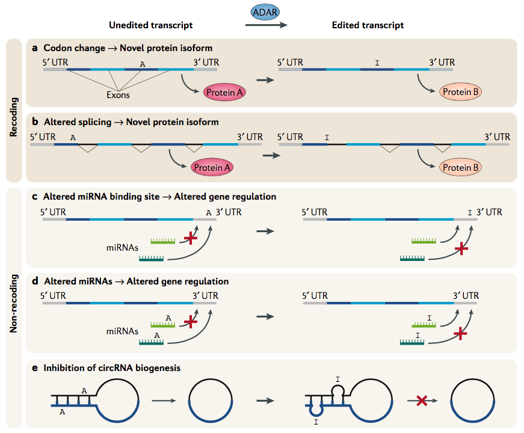

# 6.1.RNA Editing

## 1\) Background

Pre-mRNA molecules transcribed from the genome may fold to form double-stranded RNA \(dsRNA\) secondary structures. dsRNA-specific adenosine deaminase \(ADAR\) enzymes bind these structures and deaminate some adenosines to inosines. If these inosines are located in an exon, they will be present in the mature mRNA.


Reverse transcription replaces inosines in mRNA with guanosines in the cDNA. Thus, the hallmark of RNA editing is a consistent A → G mismatch between RNA sequencing \(RNA-seq\) data and the reference genomic sequence to which it is aligned.


Four main types of mRNA editing have been studied in recent decades. A-to-I RNA editing is the most common in terms of the range of organisms affected, the breadth of tissues edited and the number of editing sites.


Editing can modify protein function, generate new protein products and alter gene regulation.



## 2\) long RNA-seq（RNAEditor）

#### Paper

RNAEditor: easy detection of RNA editing events and the introduction of editing islands

### \(1\) pipeline


### \(2\) Website

[http://rnaeditor.uni-frankfurt.de/index.php](http://rnaeditor.uni-frankfurt.de/index.php)
download software and annotation files in the "Install" and "Download annotations" page.

### \(3\) Running steps

```text
RNAEditor -i Fastq-Files [Fastq-Files ...] -c Configuration File
```


1. A-to-I RNA editing — immune protector and transcriptome diversifier. Eli Eisenberg, et al. Nature Reviews, 2018.
2. RNAEditor: easy detection of RNA editing events andthe introduction of editing islands. David John, et al. Briefings in Bioinformatics, 2017.

