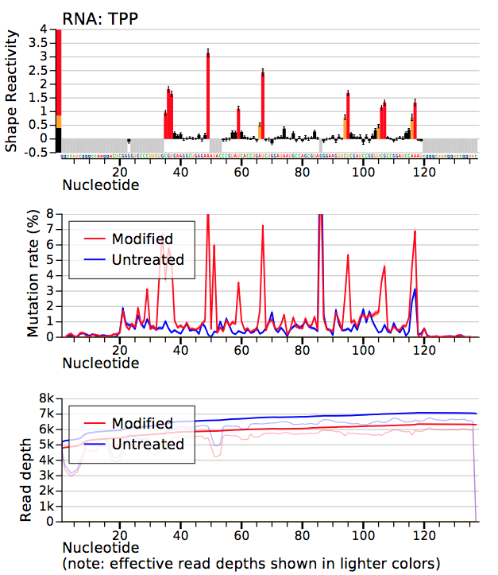

# 6.4.Structure-seq

## 1\) background


RNA is treated with a SHAPE reagent that reacts at conformationally dynamic nucleotides. During reverse transcription, polymerase reads through chemical adducts in the RNA and incorporates a nucleotide noncomplementary to the original sequence \(red\) into the cDNA. The resulting cDNA is sequenced using any massively parallel approach to create a mutational profile. Sequencing reads are aligned to a reference sequence, and nucleotide-resolution mutation rates are calculated, corrected for background and normalized, producing a standard SHAPE reactivity profile. SHAPE reactivities can then be used to model secondary structures, visualize competing and alternative structures, or quantify any process or function that modulates local nucleotide RNA dynamics.

## 2\) running steps (shapemapper)

ShapeMapper automates the calculation of RNA structure probing reactivities from mutational profiling \(MaP\) experiments, in which chemical adducts on RNA are detected as internal mutations in cDNA through reverse transcription and read out by massively parallel sequencing.

download scripts and example data from: https://github.com/Weeks-UNC/shapemapper2

```text
shapemapper \
--target TPP.fa \
--name "example-results" \
--overwrite \
--modified --folder TPPplus \
--untreated --folder TPPminus \
--star-aligner
--verbose
#--denatured --folder TPPdenat
```

### \(1\) input

1. TPPplus: modified fasta file
2. TPPminus: untreated fasta file

### \(2\) output

1. example-results\_TPP\_histograms.pdf

   

2. example-results\_TPP\_profiles.pdf

   

3. example-results\_TPP.shape

   ```text
   1    -999
   2    -999
   3    -999
   ```

   explanation for each column:

   ```text
   column1: nucleotide number 
   column2: reactivity
   ```

4. example-results\_TPP.map

   ```text
   1    -999    0    G
   2    -999    0    G
   3    -999    0    C
   ```

   explanation for each column:

   ```text
   column1: nucleotide number 
   column2: reactivity
   column3: standard error
   column4: nucleotide sequence
   ```

5. example-results\_TPP\_profile.txt

   ```text
   Nucleotide    Sequence    Modified_mutations    Modified_read_depth    Modified_effective_depthModified_rate    Untreated_mutations    Untreated_read_depth    Untreated_effective_depth    Untreated_rate    Denatured_mutations    Denatured_read_depth    Denatured_effective_depth    Denatured_rate    Reactivity_profile    Std_err    HQ_profile    HQ_stderr    Norm_profile    Norm_stderr
   1    g    0    4788    4335    0.000000    0    5206    4666    0.000000    0    nan    0.000000    0.000000    nan    nan    nan    nan
   2    g    0    4837    3405    0.000000    0    5270    3643    0.000000    0    nan    0.000000    0.000000    nan    nan    nan    nan
   ```
   
   
## 3\) Homework
简述structure-seq的原理，查阅文献解释reactivity的含义。
